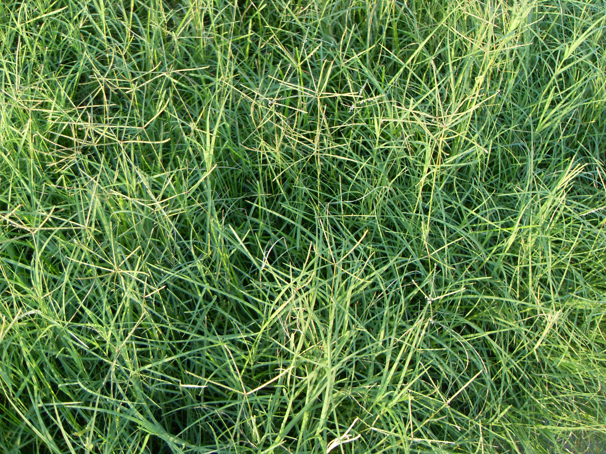

## 狗牙根

---

**拉丁名:**  _Cynodon dactylon (Linn.) Pers _

**科 属:** 禾本科 狗牙根属

**别 名:** 爬地草、绊根草
 【形  态】多年生草本，有明显的根茎，秆匍匐地面而生
  ，长约1米。叶鞘无毛，有脊；叶舌短小，叶片线形，长1
  ～5厘米，宽1～3毫米。穗状花序长2～5厘米，3～6枚呈指
  状排列在茎顶；小穗长2～2.5毫米，2颖近于等长，花药黄
  色或紫色。花期5～6月，果期7～10月。
 【西大分布地】常见杂草，也用于草坪种植，见于三校区各处。
 备注:
     2009年7月27日摄于西北大学南校区待开发区内。
　

**原产地:** 狗牙根
详细资料： 首页 下一页 上一页 
【拉丁名】Cynodon dactylon (Linn.) Pers.
【科 属】禾本科 狗牙根属
【别 名】爬地草、绊根草
【形 态】多年生草本，有明显的根茎，秆匍匐地面而生
 ，长约1米。叶鞘无毛，有脊；叶舌短小，叶片线形，长1
 ～5厘米，宽1～3毫米。穗状花序长2～5厘米，3～6枚呈指
 状排列在茎顶；小穗长2～2.5毫米，2颖近于等长，花药黄
 色或紫色。花期5～6月，果期7～10月。
【西大分布地】常见杂草，也用于草坪种植，见于三校区各处。
备注:
 2009年7月27日摄于西北大学南校区待开发区内。
　

**形  态:** 多年生草本，有明显的根茎，秆匍匐地面而生，长约1米。叶鞘无毛，有脊；叶舌短小，叶片线形，长1～5厘米，宽1～3毫米。穗状花序长2～5厘米，3～6枚呈指状排列在茎顶；小穗长2～2.5毫米，2颖近于等长，花药黄色或紫色。花期5～6月，果期7～10月。

**西大分布地:** 常见杂草，也用于草坪种植，见于三校区各处。

**备注:** 狗牙根详细资料：首页下一页上一页【拉丁名】Cynodondactylon(Linn.)Pers.【科属】禾本科狗牙根属【别名】爬地草、绊根草【形态】多年生草本，有明显的根茎，秆匍匐地面而生，长约1米。叶鞘无毛，有脊；叶舌短小，叶片线形，长1～5厘米，宽1～3毫米。穗状花序长2～5厘米，3～6枚呈指状排列在茎顶；小穗长2～2.5毫米，2颖近于等长，花药黄色或紫色。花期5～6月，果期7～10月。【西大分布地】常见杂草，也用于草坪种植，见于三校区各处。备注:2009年7月27日摄于西北大学南校区待开发区内。　

.JPG) 

 

