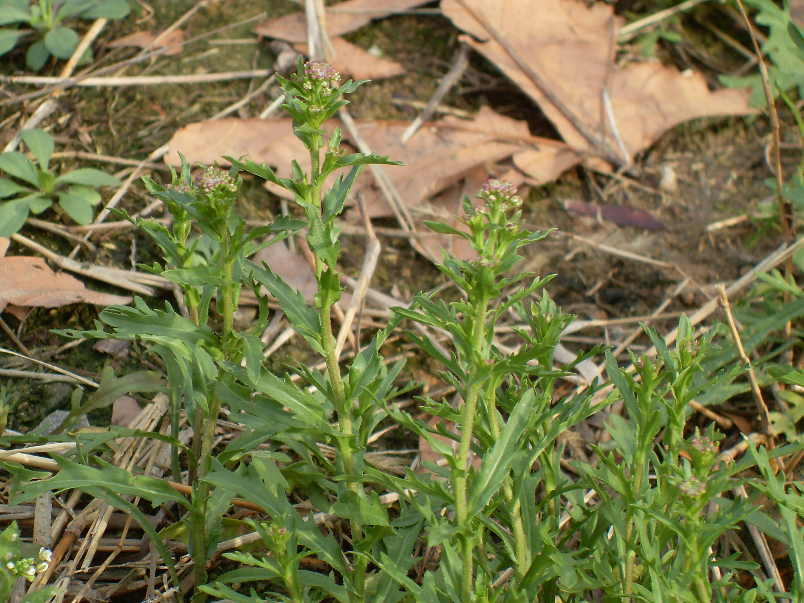

## 独行菜

---

**拉丁名:**  _Lepidium apetalum Willd. _

**科 属:** 十字花科 独行菜属

**别 名:** 北葶苈子
【形  态】一年或2年生草本。全体无毛，茎直立，高9-60厘米，
 有棱。基生叶有柄，叶片倒卵状长圆形，全缘；茎生叶无柄，
 叶片长圆状或或披针形或倒披针形，基部两侧箭形抱茎，边缘
 具疏齿。总状花序顶生，顶端常成淡紫红色；花瓣通常退化，
 4瓣，白色。短角果近圆形，扁平，先端凹陷，边缘有狭翅。种
  子椭圆形，棕红色，粗糙。花果期4～6月。
【西大分布地】早春杂草，见于桃园校区文化山南侧。
备注：
     2009年3月28日摄于西北大学桃园校区文化山南侧。

**原产地:** 独行菜
详细资料： 首页 下一页 上一页
【拉丁名】Lepidium apetalum Willd. 
【科 属】十字花科 独行菜属
【别 名】北葶苈子

**形  态:** 一年或2年生草本。全体无毛，茎直立，高9-60厘米，有棱。基生叶有柄，叶片倒卵状长圆形，全缘；茎生叶无柄，叶片长圆状或或披针形或倒披针形，基部两侧箭形抱茎，边缘具疏齿。总状花序顶生，顶端常成淡紫红色；花瓣通常退化，4瓣，白色。短角果近圆形，扁平，先端凹陷，边缘有狭翅。种子椭圆形，棕红色，粗糙。花果期4～6月。

**西大分布地:** 早春杂草，见于桃园校区文化山南侧。

**备注:** 2009年3月28日摄于西北大学桃园校区文化山南侧。

.JPG) 

 

