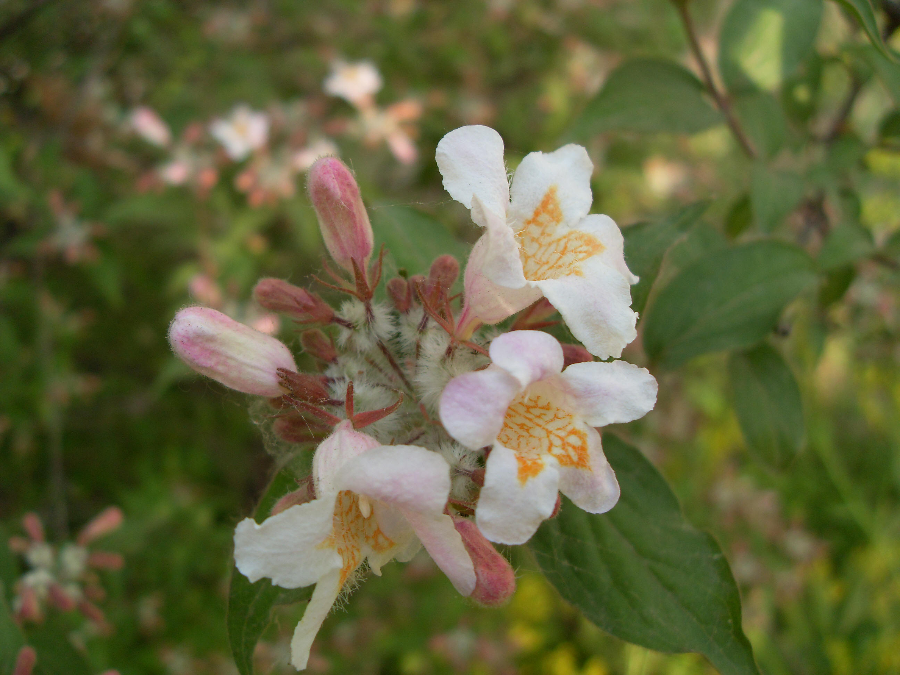
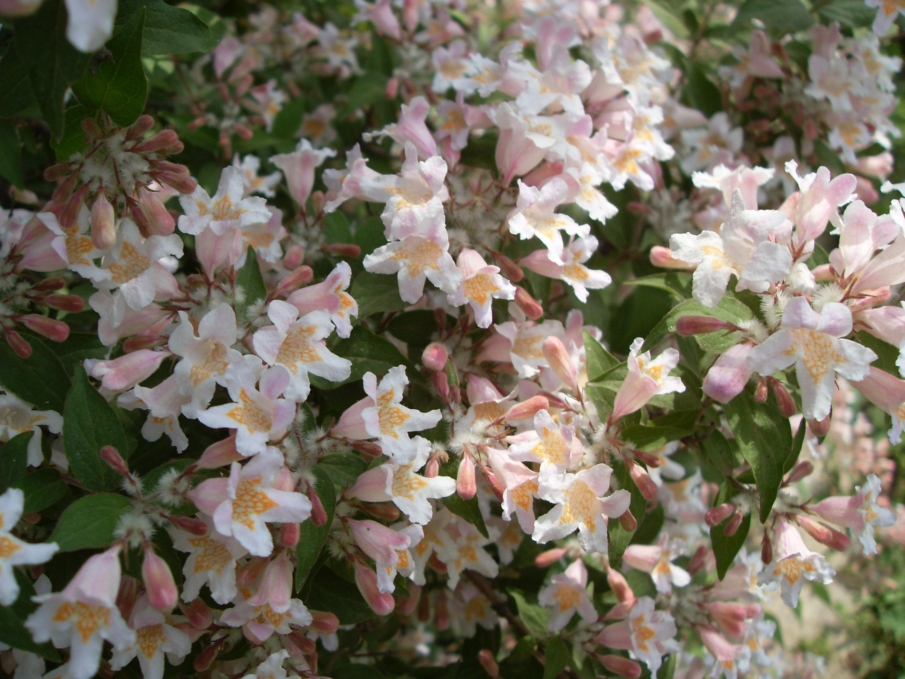

## 猬实

---

**拉丁名:**  _Kolkwitzia amabilis Graebn_

**科 属:** 忍冬科 猬实属

**别 名:** 千层皮

**原产地:** 中国中部（国家二级保护植物）

**形  态:** 落叶灌木，高1.5～3m，幼枝被柔毛，老枝皮剥落。叶交互对生，有短柄，椭圆形至卵状长圆形，长3～8cm，宽1.5～3厘米，近全缘或疏具浅齿，先端渐尖，基部近圆形，上面疏生短柔毛，下面脉上有柔毛。伞房状的圆锥聚伞花序生侧枝顶端；每一聚伞花序有2花，两花的萼筒下部合生；萼筒有开展的长柔毛，在于房以上处缢缩似颈，裂片5，钻状披针形，长3～4mm，有短柔毛；花冠钟状，粉红色至紫色，喉部黄色，外有微毛，裂片5，略不等长。瘦果2个合生，通常只1个发育成熟，连同果梗密被刺状刚毛，顶端具宿存花粤。5～6月开花，果期8～9月。

**西大分布地:** 仅在北校区西大花园内有一株。

**备注:** 2009年4月13日摄于西北大学北校区西大花园内。　

.JPG) 

 

 

