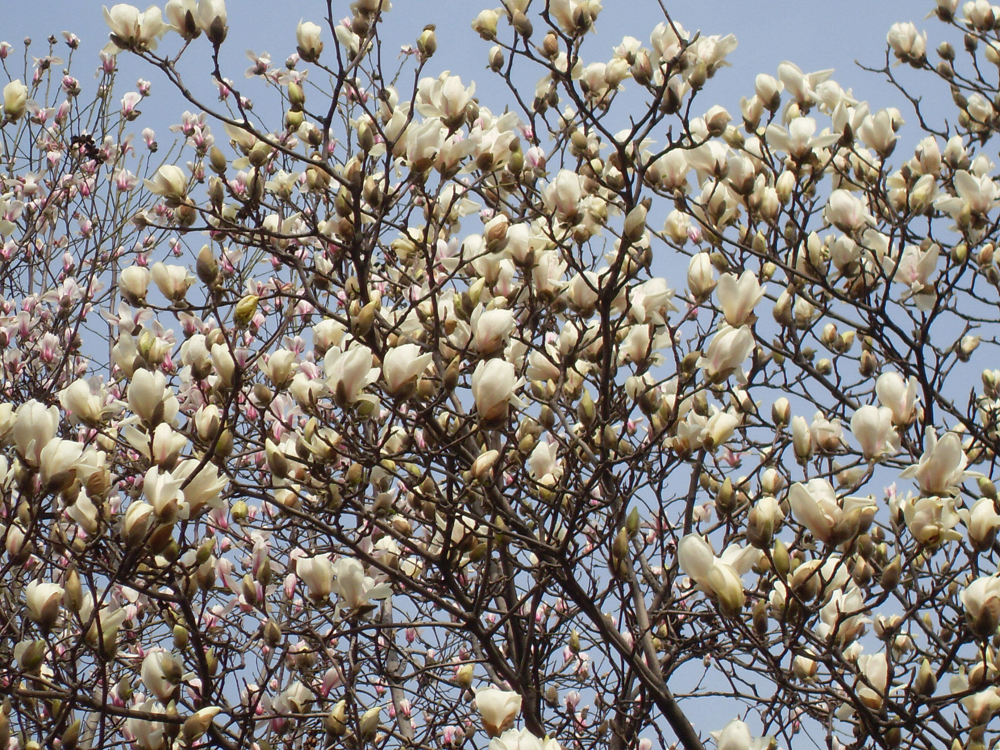
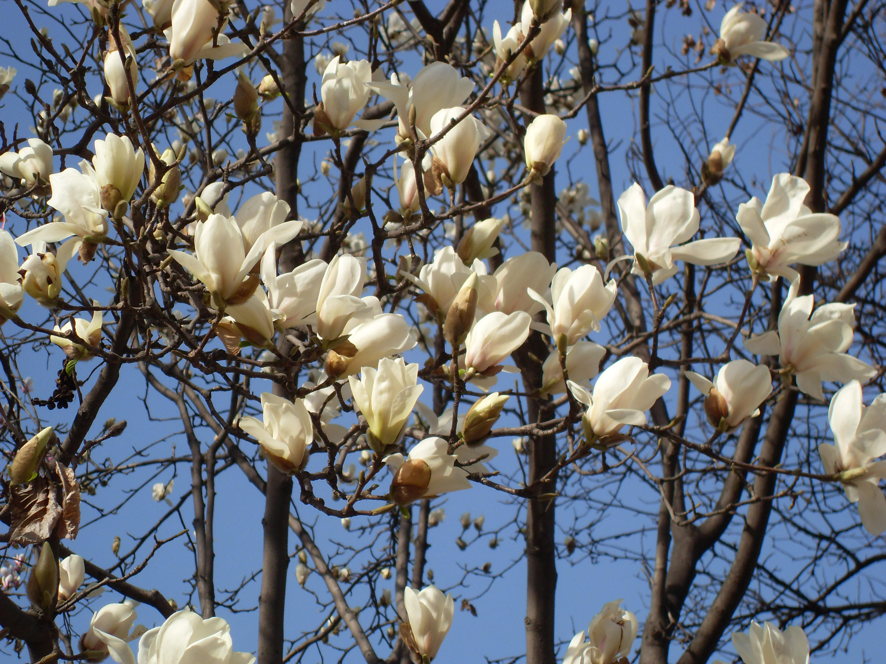
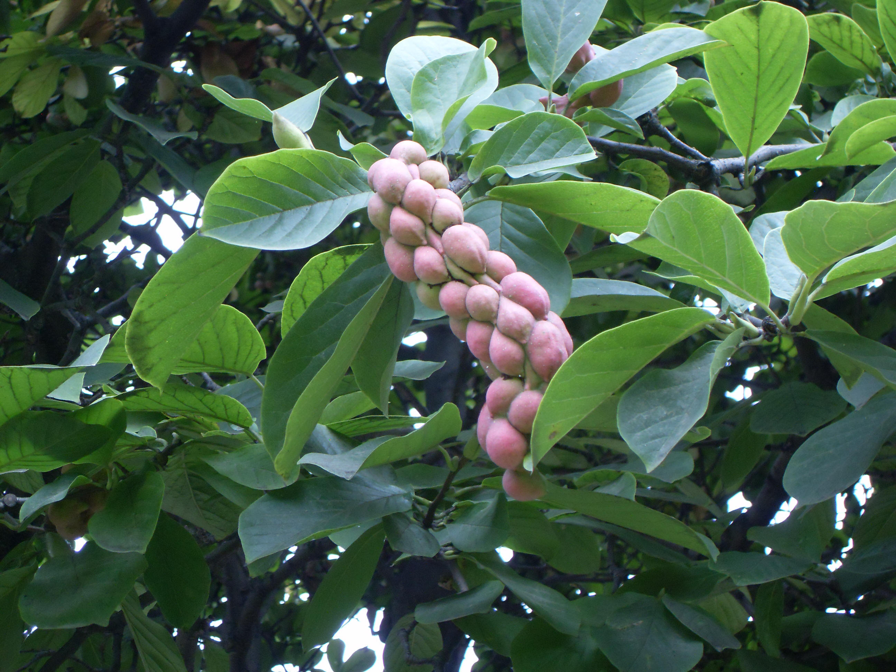

## 玉兰

---

**拉丁名:**  _Magnolia denudata Desr_

**科 属:** 木兰科 木兰属

**别 名:** 望春花、白玉兰

**原产地:** 中国中部

**形  态:** 落叶乔木，高达15米，树冠卵形或近球形。幼枝及芽均无毛。叶倒卵长长椭圆形，长10～15厘米，幼时背面有毛。花蕾卵圆状，先也开放，直立，芳香，直径10～16厘米；花被片9片，白色，基部长带粉红色，近相似，长圆状倒卵形。聚合果圆柱形，熟时红色。种子心形，外种皮红色，内种皮黑色。花期2～3月，果期8～9月。　　　

**西大分布地:** 北校区集中分布于图书馆前行道两侧。 

**备注:** 玉兰详细资料：首页下一页上一页【拉丁名】MagnoliadenudataDesr.【科属】木兰科木兰属【别名】望春花、白玉兰【原产地】中国中部【形态】落叶乔木，高达15米，树冠卵形或近球形。幼枝及芽均无毛。叶倒卵长长椭圆形，长10～15厘米，幼时背面有毛。花蕾卵圆状，先也开放，直立，芳香，直径10～16厘米；花被片9片，白色，基部长带粉红色，近相似，长圆状倒卵形。聚合果圆柱形，熟时红色。种子心形，外种皮红色，内种皮黑色。花期2～3月，果期8～9月。　　　【西大分布地】北校区集中分布于图书馆前行道两侧。备注:上图为玉兰花枝，2009年3月9日摄于西北大学北校区图书馆前行道旁；左图为玉兰果实，2009年8月21日摄于西北大学北校区图书馆前行道旁。

 

 

 

