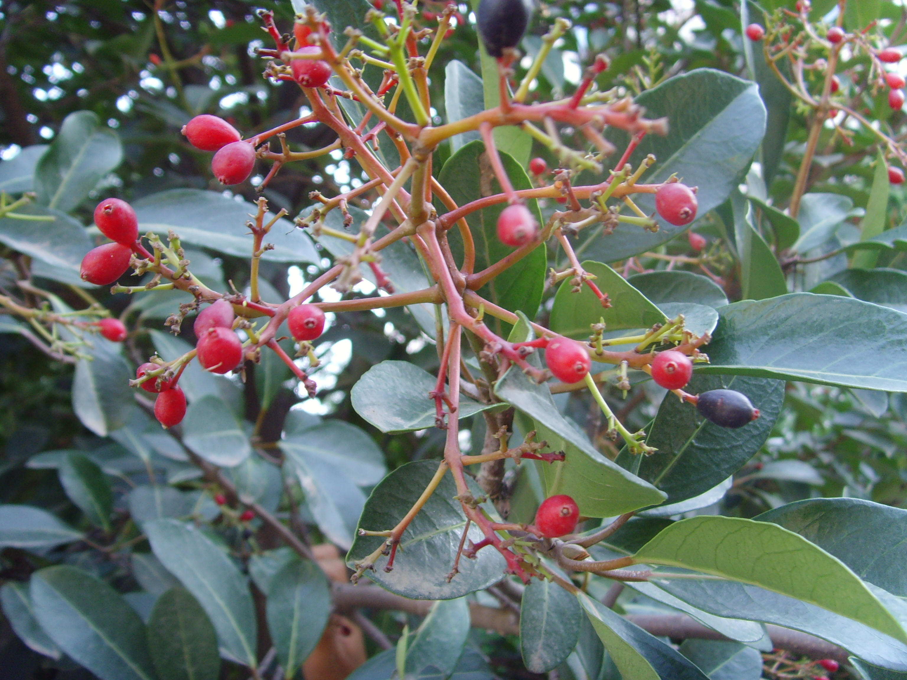
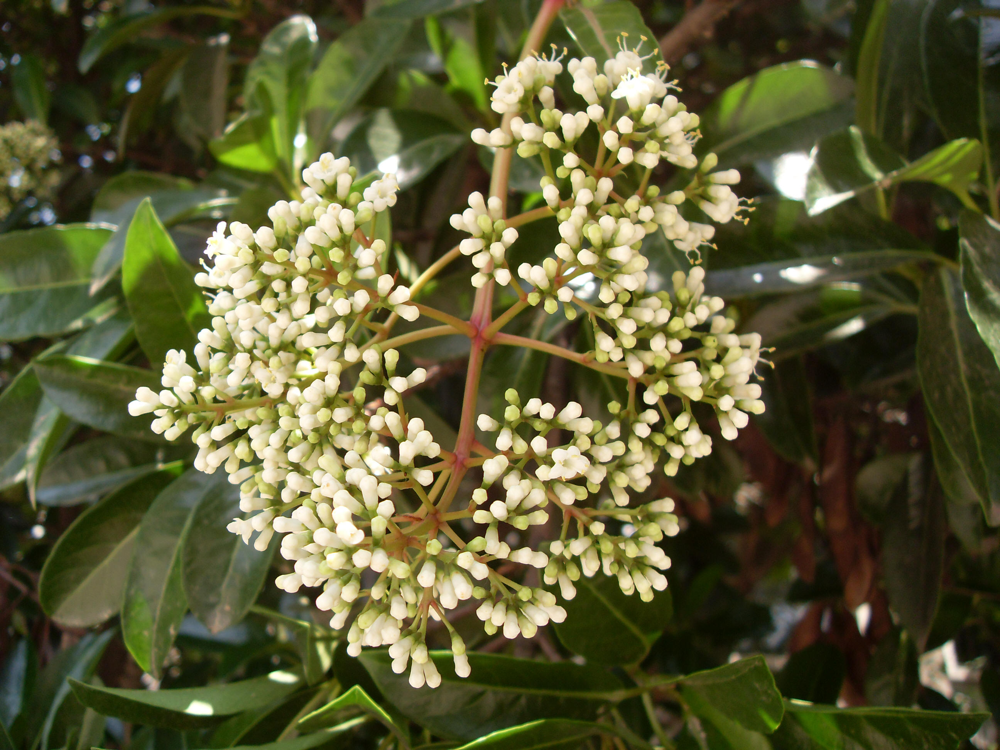

## 珊瑚树

---

**拉丁名:**  _Viburnum awabuki k.koch_

**科 属:** 忍冬科 荚蒾属

**别 名:** 法国冬青

**原产地:** 中国华南、西南，日本，印度

**形  态:** 常绿灌木或小乔木，高2～10米。全体无毛，树皮灰色，枝有小瘤状凸起的皮孔。叶长椭圆形，长7～15厘米，先端急尖或钝，基部阔楔形，全缘或近顶部有不规则的浅波状锯齿，革质，表面深绿有光泽，背面浅绿色。圆锥状聚伞花序顶生，长5～10厘米；萼筒钟状，5小裂；花冠辐状，白色，芳香，5裂，花期5～6月。核果倒卵状，先红后黑，果期9～10月。　　　　

**西大分布地:** 北校区集中在于六、七号教学楼左右； 南校区集中在学生宿舍周围。　 

**备注:** 上图为珊瑚树果枝，2008年9月5日摄于西北大学北校区西大花房大门南侧；左图为珊瑚树花枝，2009年5月20日摄于西北大学北校区六号教学楼前。

 

 

