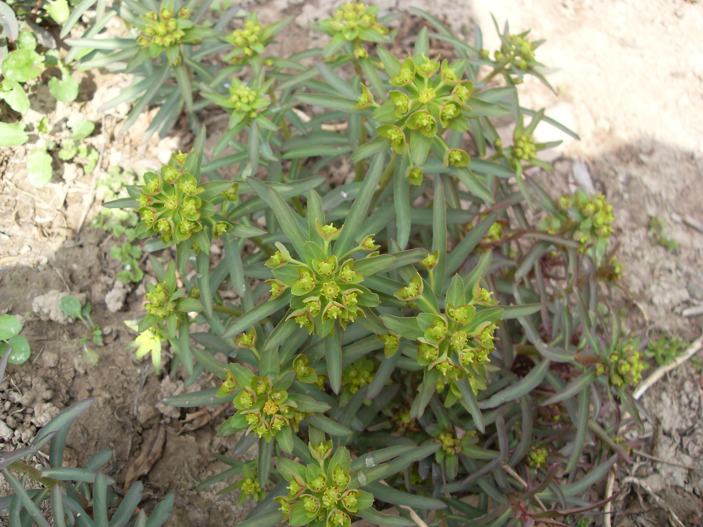

## 甘遂

---

**拉丁名:**  _Euphorbia kansui T. N. Liou ex S. B. Ho _

**科 属:** 大戟科 大戟属

**别 名:** Euphorbia kansui T. N. Liou ex S. B. Ho 【科 属】大戟科 大戟属

**原产地:** 不详

**形  态:** 多年生宿根草本，高25～40厘米。有乳汁，根长，稍弯曲，末端成念珠状，外皮棕褐色。茎无毛。叶互生，近无柄，现状披针形或披针形，全缘，无毛。顶生总花序有5～9伞柄，每伞柄再2叉分枝；苞片三角状宽卵形，全缘；杯状花序总苞钟状，先端4裂，腺体4，生于裂片之间外缘，呈新月状，黄色；蒴果近球形，种子近球形。花期3月，果期5月。

**西大分布地:** 仅见于北校区西大花园内

**备注:** 2009年3月23日摄于西北大学北校区西大花园内。

 

.JPG) 

