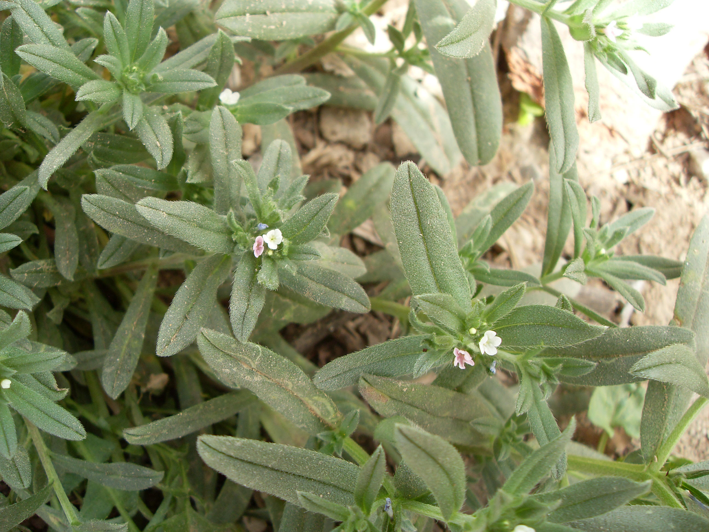

## 田紫草

---

**拉丁名:**  _Lithospermum arvense Linn_

**科 属:** 紫草科 紫草属

**别 名:** 麦家公

**原产地:** 不详

**形  态:** 一年生草本。径分枝多，直立或斜上，高20～35厘米，茎叶密被斜生粗毛。叶互生，倒披针形或狭倒披针形；叶无柄或近无柄。花序长达10厘米，有密生粗毛，花冠先白色或淡红色后变蓝紫色，长7～9毫米，喉部有5个附属物，裂片5，狭倒卵形。小坚果卵形，一面有棱，淡褐色，无柄，有疣状突起。花期3～6月，果期4～7月。

**西大分布地:** 早春常见杂草，常见于三校区。

**备注:** 2009年3月22日摄于西北大学南校区模拟法庭对面草丛。

.JPG) 

 

