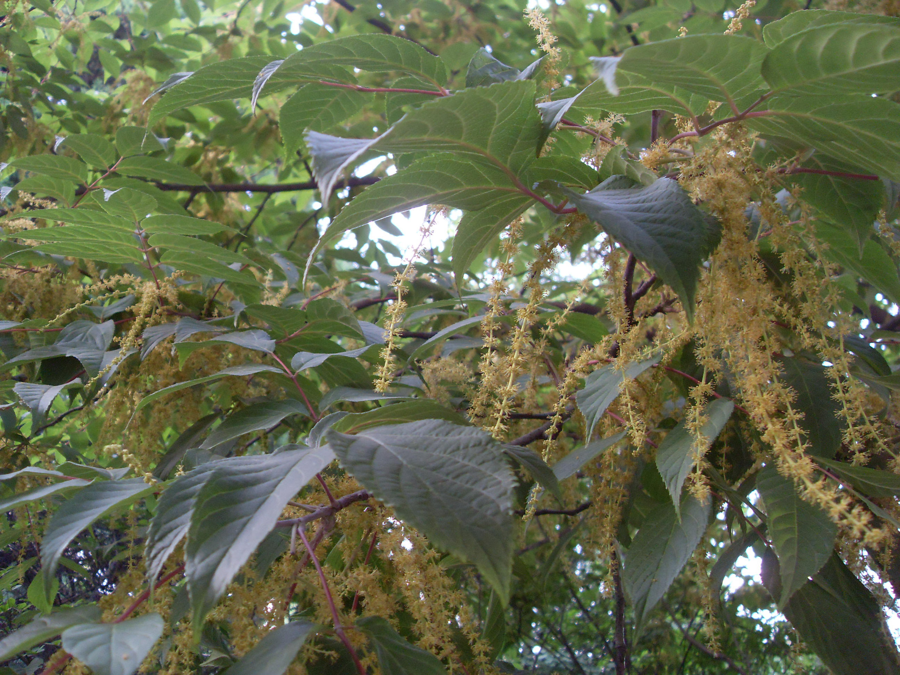

## 瘿椒树

---

**拉丁名:**  _Tapiscia sinensis Oliv. _

**科 属:** 省沽油科 瘿椒树属

**别 名:** 银鹊树

**原产地:** 中国南部

**形  态:** 落叶乔木，高8～15米，树皮灰黑色或灰白色。奇数羽状复叶，长达30厘米；小叶5～6，狭卵形或卵形，长6～14厘米，宽3.5～6厘米，基部心形或近心形，边缘具锯齿。圆锥花序腋生，雄花与两性花异株。果穗长达10厘米，核果近球形或椭圆形。　　　　　

**西大分布地:** 见于北校区生命科学学院南侧木香园前及地质系前东侧林下。

**备注:** 上图为瘿椒树花枝，2009年5月31日摄于西北大学北校区生命科学学院南侧；左图为瘿椒树果实，2009年4月17日摄于西北大学北校区生命科学学院南侧。

 

