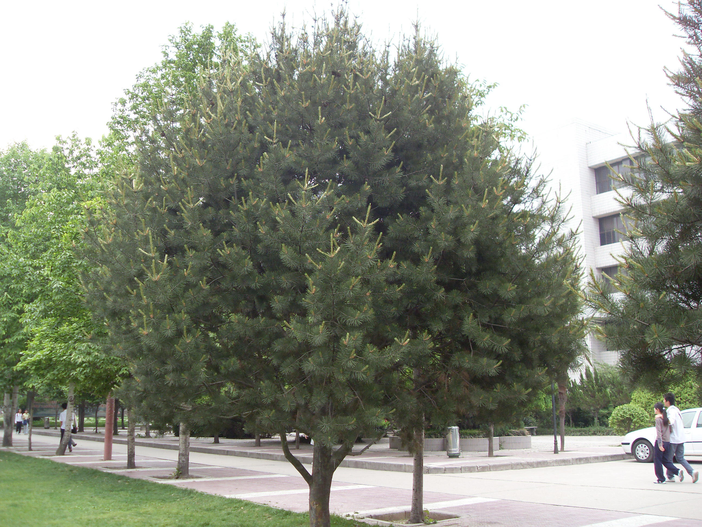
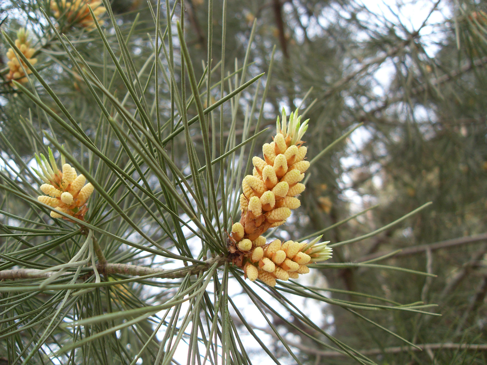

## 白皮松

---

**拉丁名:**  _Pinus bungeana Zucc. et Endi _

**科 属:** 松科 松属

**别 名:** 虎皮松、白骨松

**原产地:** 中国

**形  态:** 常绿乔木，高达30米；树冠阔圆锥形、卵形或圆头形。树皮淡灰绿色或粉白色，呈不规则鳞片状剥落。大枝自近地面斜出。针叶3针1束，长5～10厘米，边缘有细锯齿，树脂道边生；基部叶鞘早落。雄球花序长约10厘米，鲜黄色；球果圆锥状卵形，长5～7厘米，熟时淡黄褐色。种子大，卵形褐色，有翅。花期4～5月，果次年9～11月成熟。　　　　

**西大分布地:** 北校区见于物理系前行道两侧及图书馆四周

**备注:** 上图为白皮松单株树形，2009年4月17日摄于西北大学北校区图书馆前草坪；左图为白皮松雄球花，2009年4月17日摄于西北大学北校区图书馆东侧。

 

 

