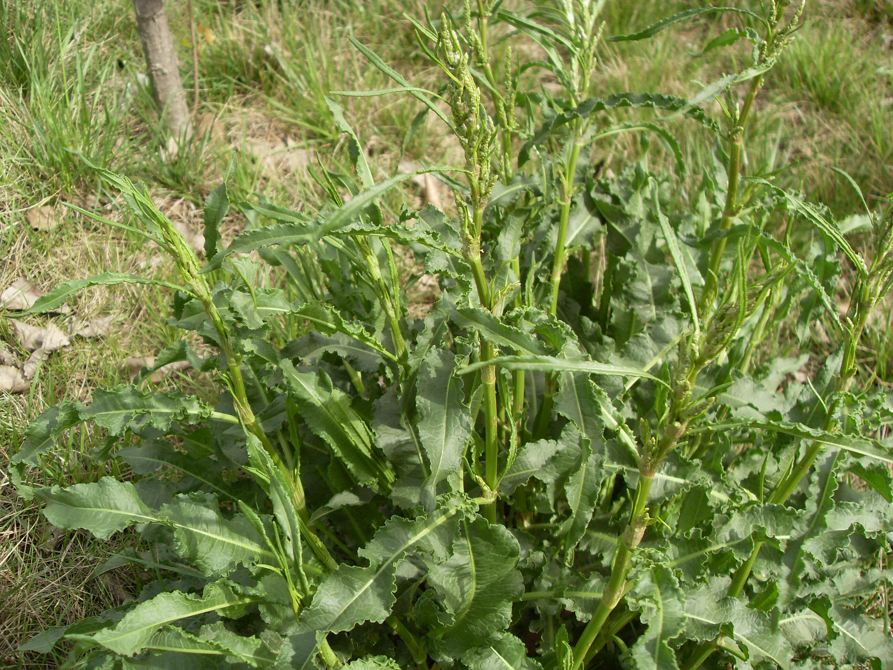

## 皱叶酸模

---

**拉丁名:**  _Rumex crispus Linn. _

**科 属:** 蓼科 酸模属

**别 名:** 洋铁叶子、土大黄
【形  态】多年生草本，高50–100厘米。直根，粗壮。茎直立，有
 浅沟槽，通常不分枝，无毛。根生叶有长柄，叶片披针形或长圆状
 披针形，长15～25厘米，宽1.5～4厘米，两面无毛，顶端和基部渐
 狭，边缘有波状皱褶；茎上部叶小，有短柄；托叶鞘，筒状，膜质。
 花序有数个腋生的总状花序组成圆锥状，顶生狭长，长达60厘米；
 瘦果椭圆形，3棱，顶端尖，棱角锐利，长2毫米，褐色，有光泽。花
 期6～7月，果期7–8月。 
【西大分布地】仅见于南校区待开发区草丛中。
备注：
    2009年4月24日摄于西北大学南校区待开发区草丛中。　

**原产地:** 皱叶酸模
详细资料： 首页 下一页 上一页
【拉丁名】Rumex crispus Linn. 
【科 属】蓼科 酸模属
【别 名】洋铁叶子、土大黄

**形  态:** 多年生草本，高50–100厘米。直根，粗壮。茎直立，有浅沟槽，通常不分枝，无毛。根生叶有长柄，叶片披针形或长圆状披针形，长15～25厘米，宽1.5～4厘米，两面无毛，顶端和基部渐狭，边缘有波状皱褶；茎上部叶小，有短柄；托叶鞘，筒状，膜质。花序有数个腋生的总状花序组成圆锥状，顶生狭长，长达60厘米；瘦果椭圆形，3棱，顶端尖，棱角锐利，长2毫米，褐色，有光泽。花期6～7月，果期7–8月。

**西大分布地:** 仅见于南校区待开发区草丛中。

**备注:** 2009年4月24日摄于西北大学南校区待开发区草丛中。　

 

