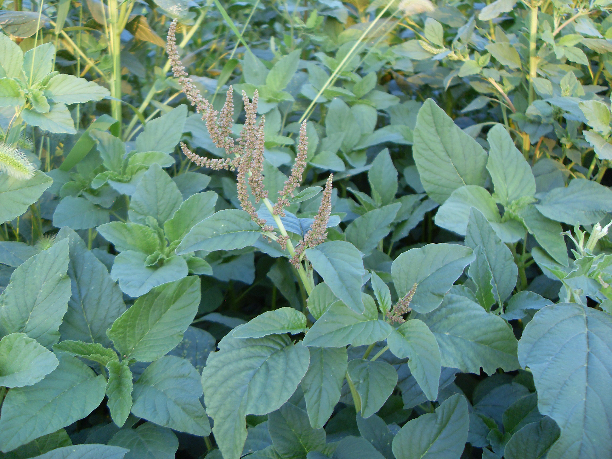

## 皱果苋

---

**拉丁名:**  _Amaranthus viridis Linn _

**科 属:** 苋科 苋属

**别 名:** 绿苋
 【原产地】热带美洲
 【形  态】一年生草本，高40～80厘米，全体无毛；茎直立
  ，有不显明棱角，稍有分枝，绿色或带紫色。叶卵形、卵
  状长圆形或卵状椭圆形，先端常凹缺，少数圆钝，有1短
  尖头。圆锥花序顶生，有分枝，顶生花穗比侧生者长；苞
  片及小苞片披针形，长不及1mm，顶端具凸尖。胞果扁球形
  ，直径约2mm，绿色，不裂，极皱缩，超出花被片。花期6～
  8月，果期8～10月。
 【西大分布地】常见杂草，见于三校区各处。
备注：
    2009年7月27日摄于西北大学南校区待开发区内。

**原产地:** 热带美洲
【形 态】一年生草本，高40～80厘米，全体无毛；茎直立
 ，有不显明棱角，稍有分枝，绿色或带紫色。叶卵形、卵
 状长圆形或卵状椭圆形，先端常凹缺，少数圆钝，有1短
 尖头。圆锥花序顶生，有分枝，顶生花穗比侧生者长；苞
 片及小苞片披针形，长不及1mm，顶端具凸尖。胞果扁球形
 ，直径约2mm，绿色，不裂，极皱缩，超出花被片。花期6～
 8月，果期8～10月。
【西大分布地】常见杂草，见于三校区各处。
备注：
 2009年7月27日摄于西北大学南校区待开发区内。

**形  态:** 一年生草本，高40～80厘米，全体无毛；茎直立，有不显明棱角，稍有分枝，绿色或带紫色。叶卵形、卵状长圆形或卵状椭圆形，先端常凹缺，少数圆钝，有1短尖头。圆锥花序顶生，有分枝，顶生花穗比侧生者长；苞片及小苞片披针形，长不及1mm，顶端具凸尖。胞果扁球形，直径约2mm，绿色，不裂，极皱缩，超出花被片。花期6～8月，果期8～10月。

**西大分布地:** 常见杂草，见于三校区各处。

**备注:** 2009年7月27日摄于西北大学南校区待开发区内。

.JPG) 

 

