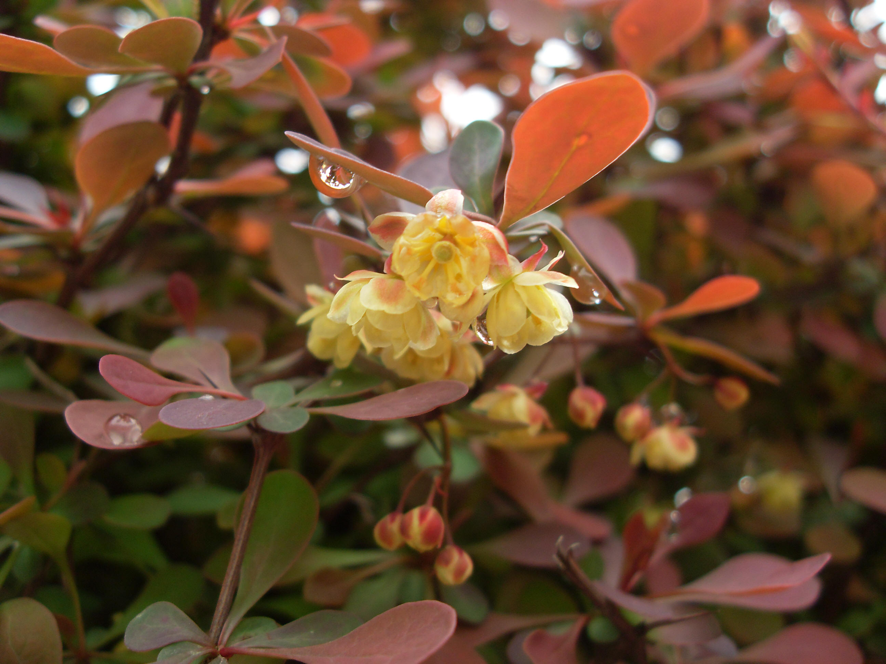
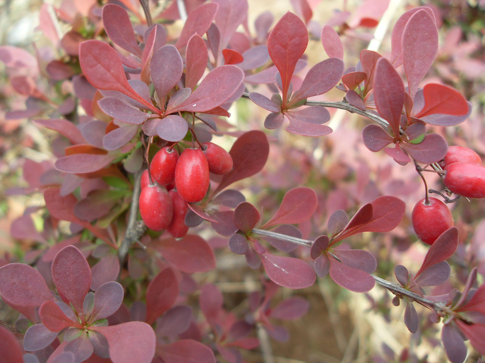
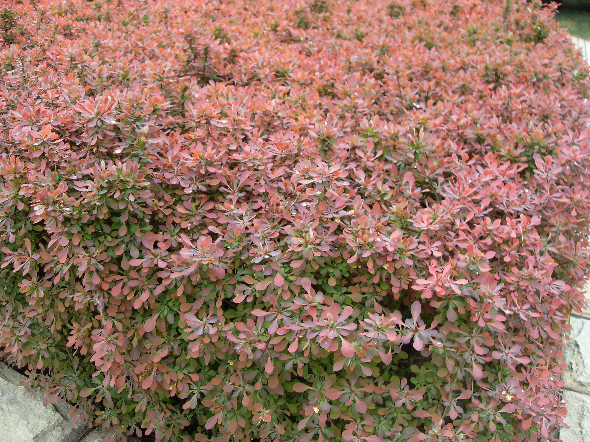

## 矮紫小檗

---

**拉丁名:**  _Berberis thumbergii DC.cv.atropurpurea.Nana_

**科 属:** 小檗科 小檗属

**别 名:** 日本小檗、紫叶小檗

**原产地:** 原种产中国、日本

**形  态:** 落叶灌木，株高近60厘米。幼枝紫红色带绿色，老枝紫褐色，次单生叶菱状卵形或倒卵形，长1～2厘米，宽5～12厘米，全缘，有时有细小的短尖头。花2～5朵成伞形花序或近簇生，花黄色，有红色晕纹，下垂，花萼2轮；花瓣长圆状倒卵形。浆果椭圆状，亮红色，长约8毫米。花期4～6月，果期7～10月。　　　　　　　　　　　

**西大分布地:** 常见行道篱植物，散见于三校区各处。

**备注:** 右上图为矮紫小檗丛植景观，摄于2009年3月28日西北大学北校区生科院后花坛。右下图为矮紫小檗花枝，摄于2009年3月28日西北大学北校区生科院后花坛。左图为矮紫小檗果实，摄于2009年3月29日西北大学南校区教学四号楼后。

.JPG) 

 

 

 

