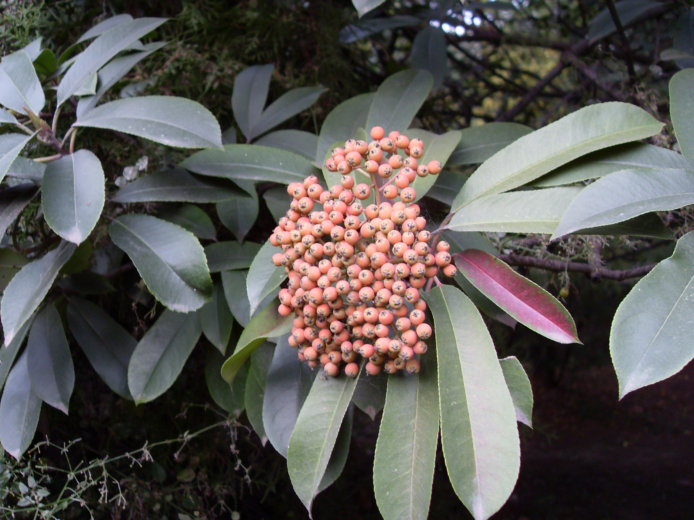
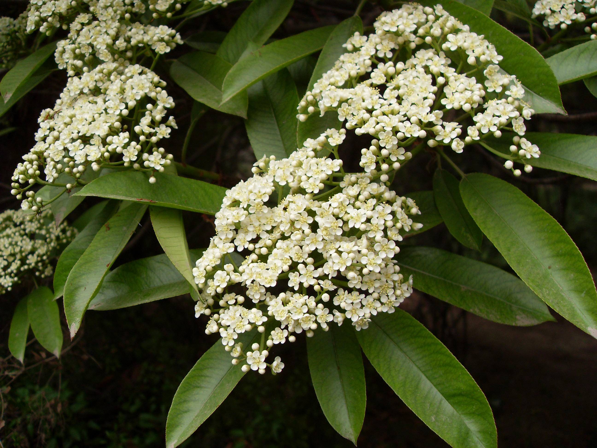

## 石楠

---

**拉丁名:**  _Photinia serralata Lindl _

**科 属:** 蔷薇科 石楠属

**别 名:** 扇骨木，千年红
 【原产地】中国
 【形  态】常绿小乔木，高达12米。叶长椭圆形，长8～20厘米
  ，先端尖，基部圆形或广楔形，缘有细尖锯齿，革质有光泽，
  幼叶有红色。花白色，径6～8毫米，成顶生复伞房花序，花期
  5～7月。果球形径5～6毫米，红色，果熟10月。
 【西大分布地】北校区多分布于7号楼花坛东侧，图书馆前。南
  校区分布较散，多为幼龄树。桃园校区多分布于教师居住区。
　
　
　
                                                                   
                                                                        备注：
                                                                             上图为石楠果实，2008年10月25日摄于西北大学北校区七号教学楼花坛东侧。
                                                                             下图为石楠花枝，2009年4月10日西北大学北校区七号教学楼花坛东侧。

**原产地:** 中国
【形 态】常绿小乔木，高达12米。叶长椭圆形，长8～20厘米
 ，先端尖，基部圆形或广楔形，缘有细尖锯齿，革质有光泽，
 幼叶有红色。花白色，径6～8毫米，成顶生复伞房花序，花期
 5～7月。果球形径5～6毫米，红色，果熟10月。
【西大分布地】北校区多分布于7号楼花坛东侧，图书馆前。南
 校区分布较散，多为幼龄树。桃园校区多分布于教师居住区。
　
　
　

 备注：
 上图为石楠果实，2008年10月25日摄于西北大学北校区七号教学楼花坛东侧。
 下图为石楠花枝，2009年4月10日西北大学北校区七号教学楼花坛东侧。

**形  态:** 常绿小乔木，高达12米。叶长椭圆形，长8～20厘米，先端尖，基部圆形或广楔形，缘有细尖锯齿，革质有光泽，幼叶有红色。花白色，径6～8毫米，成顶生复伞房花序，花期5～7月。果球形径5～6毫米，红色，果熟10月。

**西大分布地:** 北校区多分布于7号楼花坛东侧，图书馆前。南 校区分布较散，多为幼龄树。桃园校区多分布于教师居住区。　　　 

**备注:** 上图为石楠果实，2008年10月25日摄于西北大学北校区七号教学楼花坛东侧。下图为石楠花枝，2009年4月10日西北大学北校区七号教学楼花坛东侧。

 

 

