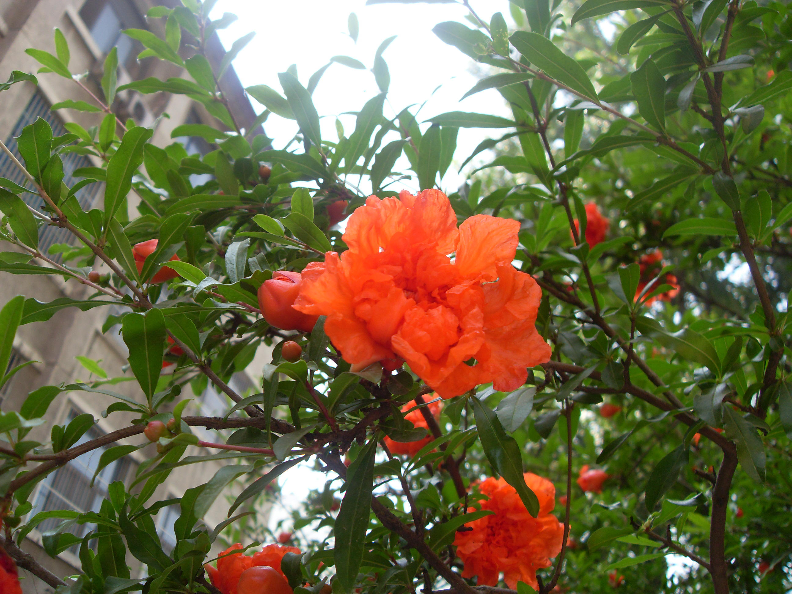

## 石榴

---

**拉丁名:**  _Punica granatum Linn_

**科 属:** 石榴科 石榴属

**别 名:** 安石榴、海榴

**原产地:** 伊朗、阿富汗

**形  态:** 落叶乔木或小乔木，高5～7米。树冠常不整齐。小枝有角棱，无毛，端常成刺状。叶倒卵状长椭圆形，长2～8厘米，无毛而有光泽，在长枝上对生，在短枝上簇生。花朱红色，径约3厘米；花萼钟形，紫红色，质厚。浆果仅球形，径6～8厘米,古铜黄色或古铜红色，具宿存花萼；种子多数，有肉质外种皮。花期5～7月，果期9～10月。　　　

**西大分布地:** 北校区集中于于八号教学楼楼东侧及七号教学楼西侧。

**备注:** 上图为一重瓣红石榴，2009年5月6日摄于西北大学北校区八号教学楼东侧。左图为一白花石榴，2009年5月20日摄于西北大学北校区图书馆楼后西侧。　

 

