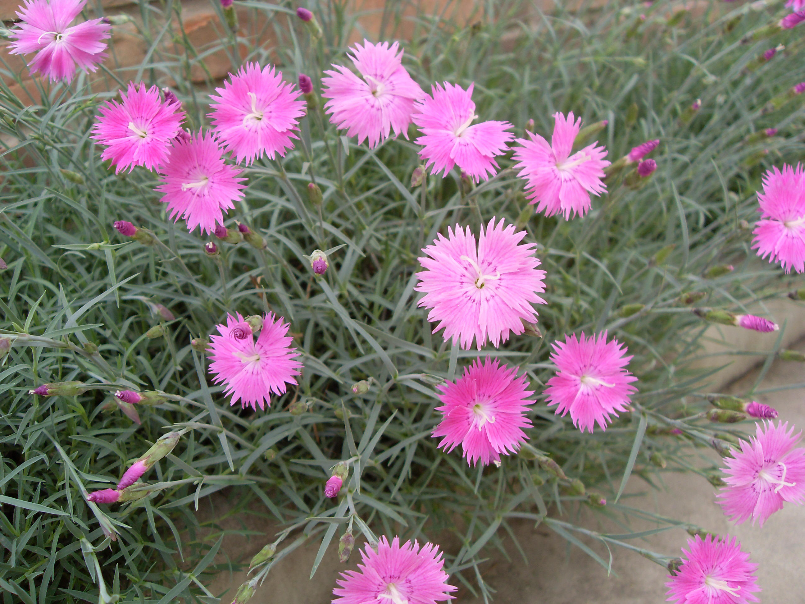

## 石竹

---

**拉丁名:**  _Dianthus chinensis Linn_

**科 属:** 石竹科 石竹属

**别 名:** 洛阳花、中国石竹

**原产地:** 中国

**形  态:** 多年生草本植物。株高30－40厘米，直立簇生。茎直立，有节，多分枝，叶对生，条形或线状披针形。花萼筒圆形，花单朵或数朵簇生于茎顶，形成聚伞花序，花径2～3厘米，花色有紫红、大红、粉红、紫红、纯白、红色、杂色，单瓣5枚或重瓣，先端锯齿状，微具香气。花瓣阳面中下部组成黑色美丽环纹，花期4月～10月，集中于4月～5月。蒴果矩圆形或长圆形，种子扁圆形，黑褐色。

**西大分布地:** 仅见于北校区西大花园内。

**备注:** 2009年4月20日摄于西北大学北校区西大花园内。　

.JPG) 

 

