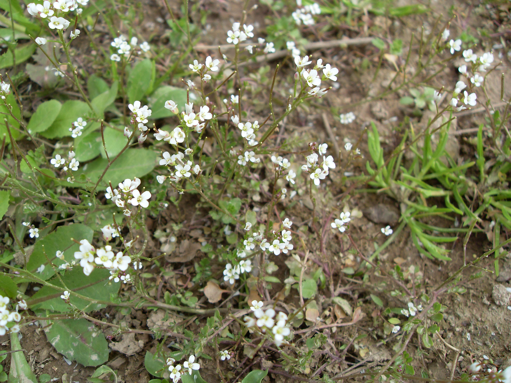

## 碎米芥

---

**拉丁名:**  _Cardamine hirsuta L_

**科 属:** 十字花科 碎米芥属

**别 名:** 米花香荠菜

**原产地:** 不详

**形  态:** 一年或二年生草本，高15～35厘米，无毛或疏生柔毛。茎直立或斜升，分枝或不分枝，下部有时呈淡紫色。叶为羽状复叶，基生叶有柄，小叶2～5对，顶生小叶卵圆形，长4～14毫米，有3～5圆齿，侧生小叶较小，歪斜；茎生小叶2～4对，狭倒卵形至线形，表面和边缘都有疏柔毛。花白色。长约3毫米。长角果线形，长达3厘米，种子每室1行，长方形，褐色。花期2～4月，果期3～5月。

**西大分布地:** 早春杂草，仅见于北校区西大花园内。

**备注:** 2009年3月23日摄于西北大学北校区西大花园内。

 

