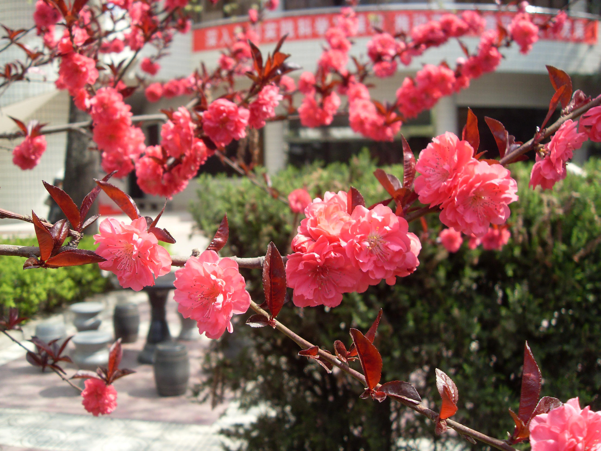

## 碧桃

---

**拉丁名:**  _Prunus persica Batsch. var. duplex Rehd_

**科 属:** 蔷薇科 李属

**别 名:** 千叶桃花

**原产地:** 中国

**形  态:** 落叶小乔木，高可达8米，一般整形后控制在3-4米，小枝红褐色，无毛；叶椭圆状披针形，长7-15厘米，先端渐尖。花单生或两朵生于叶腋，重瓣，粉红色。其它变种有白色、深红、洒金（杂色）等。花期3～4月。单花科结两枚果实，但通常不易坐果。本种植物为桃的变种，是常见的园艺观赏花木，通常用嫁接法繁殖。

**西大分布地:** 北校区见于萃园宾馆前草坪； 桃园学院集中分布在教工家属区草坪各处。

**备注:** 上图为碧桃的一红色花品种2009年3月25日摄于西北大学北校区萃园宾馆前草坪。下图左为碧桃的另一品种，白花寿星桃；下图右为红花寿星桃，摄于2009年3月28日西北大学桃园校区教工家属区草坪。　

.JPG) 

 

