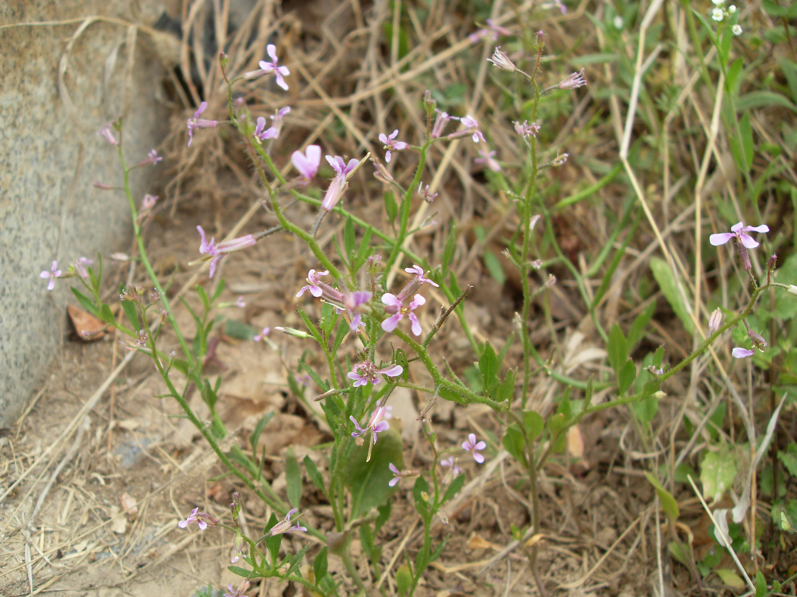
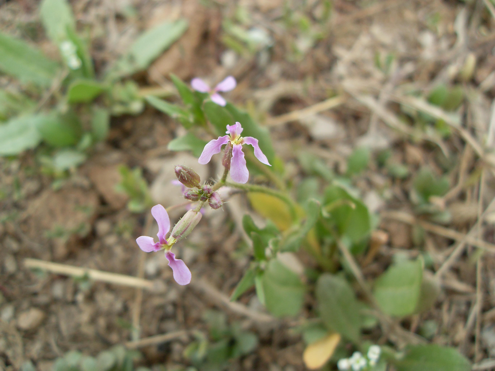
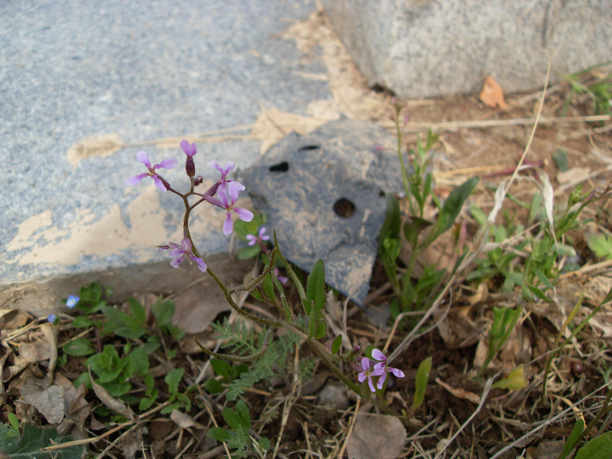

## 离子芥

---

**拉丁名:**  _Chorispora tenella (Pall.) DC_

**科 属:** 十字花科 离子芥属

**别 名:** 紫花荠菜、地地菜
【形  态】一年生或越年生草本。高5～30厘米。被粉粒状
 腺毛。茎由基部发出多数分枝，枝斜上或铺散。基生也多
 为羽状分裂，长圆状披针形或篦形，长4～8厘米，宽约1
 厘米，先端稍尖或圆钝，基部狭窄成短柄；茎生也较小，
 先端钝，基部楔形。花瓣长圆形，长7～10毫米，爪部黄
 绿色，直立，檐部紫色。长角果圆柱形，细弱，不开裂。
 种子长圆形，稍扁平，红褐色。花果期4～8月。
【西大分布地】早春常见杂草，见于西北大学南校区荒地。
备注：
    2009年3月22日摄于西北大学南校区模拟法庭对侧草丛。

**原产地:** 离子芥
详细资料：  首页 下一页 上一页
【拉丁名】Chorispora tenella (Pall.) DC.
【科 属】十字花科 离子芥属
【别 名】紫花荠菜、地地菜

**形  态:** 一年生或越年生草本。高5～30厘米。被粉粒状腺毛。茎由基部发出多数分枝，枝斜上或铺散。基生也多为羽状分裂，长圆状披针形或篦形，长4～8厘米，宽约1厘米，先端稍尖或圆钝，基部狭窄成短柄；茎生也较小，先端钝，基部楔形。花瓣长圆形，长7～10毫米，爪部黄绿色，直立，檐部紫色。长角果圆柱形，细弱，不开裂。种子长圆形，稍扁平，红褐色。花果期4～8月。

**西大分布地:** 早春常见杂草，见于西北大学南校区荒地。

**备注:** 2009年3月22日摄于西北大学南校区模拟法庭对侧草丛。

 

 

 

