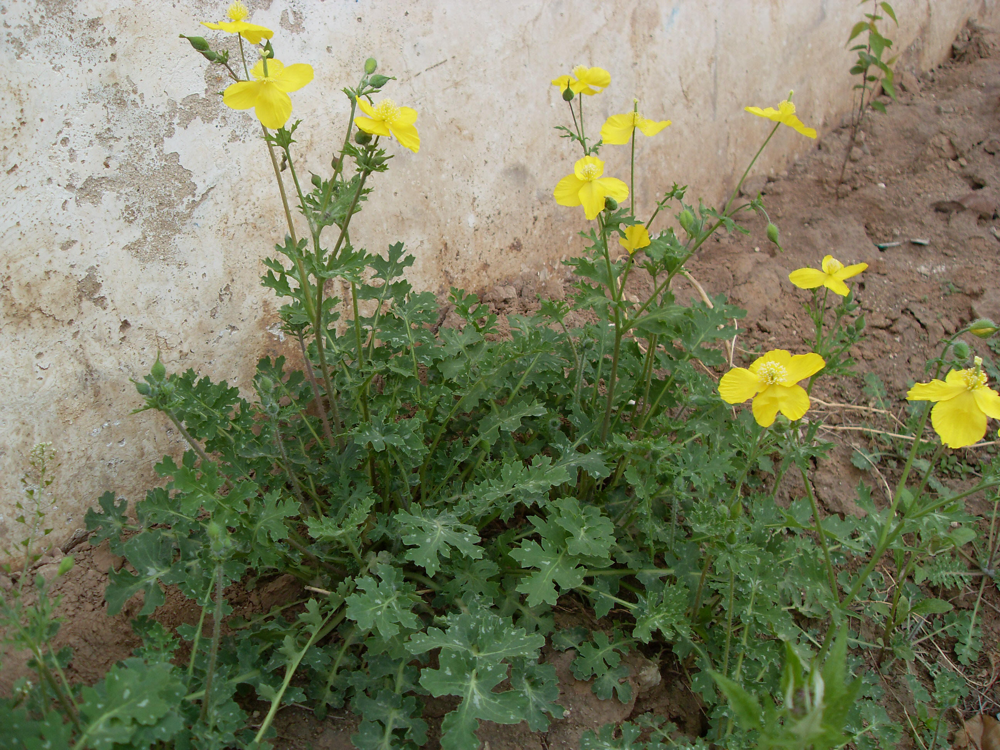
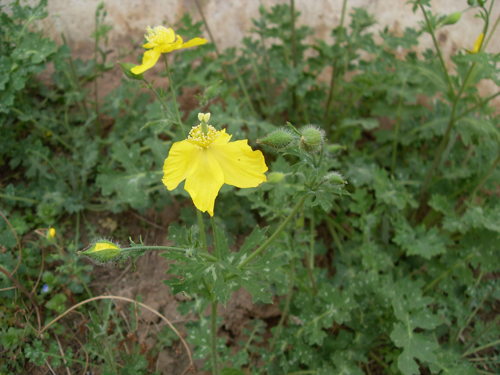

## 秃疮花

---

**拉丁名:**  _Dicranostigma leptopodum (Maxim.) Fedde_

**科 属:** 罂粟科 秃疮花属

**别 名:** 秃子花
【形  态】二年生草本，高20～80厘米。茎多丛生直立，上
 部分枝，疏生长柔毛，含白色乳汁。基生叶有柄，多数成
 莲座状，羽状深裂或全裂，长10～15厘米，宽2～5厘米。边
 缘有大型牙齿或缺刻，表面蓝绿色，背面被粉粒及疏生柔毛
 ；茎生叶少数，苞状，无柄。花直径大约3厘米，4瓣，花瓣
 圆形，亮黄色，长约1.5厘米；萼片卵圆，先端尖急；花丝扁
 平，长约花瓣之半；子房圆柱形。蒴果长圆柱形，两端细，长
 4～8厘米。种子卵圆形，暗棕色。花期3～5月，果期6～7月。
【西大分布地】早春杂草，仅见于南校区向阳荒坡及草地。
备注：
    2009年3月29日摄于西北大学南校区教学二号楼后西南角。

**原产地:** 秃疮花

【拉丁名】Dicranostigma leptopodum (Maxim.) Fedde
【科 属】罂粟科 秃疮花属
【别 名】秃子花

**形  态:** 二年生草本，高20～80厘米。茎多丛生直立，上部分枝，疏生长柔毛，含白色乳汁。基生叶有柄，多数成莲座状，羽状深裂或全裂，长10～15厘米，宽2～5厘米。边缘有大型牙齿或缺刻，表面蓝绿色，背面被粉粒及疏生柔毛；茎生叶少数，苞状，无柄。花直径大约3厘米，4瓣，花瓣圆形，亮黄色，长约1.5厘米；萼片卵圆，先端尖急；花丝扁平，长约花瓣之半；子房圆柱形。蒴果长圆柱形，两端细，长4～8厘米。种子卵圆形，暗棕色。花期3～5月，果期6～7月。

**西大分布地:** 早春杂草，仅见于南校区向阳荒坡及草地。

**备注:** 2009年3月29日摄于西北大学南校区教学二号楼后西南角。

 

 

