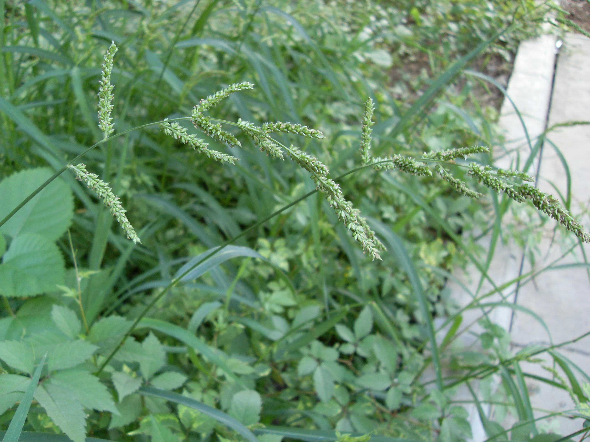

## 稗

---

**拉丁名:**  _Echinochloa crusgali (Linn.) Beauv.  _

**科 属:** 禾本科 稗属

**别 名:** 稗草、稗子
 【形  态】一年生草本，高50～150厘米，秆基倾斜或膝曲
  。叶鞘松弛；无叶舌，叶片线形，长10～40厘米，宽5～20
  毫米，边缘粗糙；圆锥花序长9～20厘米；总状花序有短枝
  ，近尖塔形；穗轴粗糙，基部有硬刺毛；小穗密集于穗轴一
  侧。颖果，花果期夏秋季。
 【西大分布地】三校区常见杂草，见于各处。
备注：
    2009年7月5日摄于西北大学北校区生命科学学院楼后。

**原产地:** 稗
详细资料： 首页 下一页 上一页 
【拉丁名】Echinochloa crusgali (Linn.) Beauv. 
【科 属】禾本科 稗属
【别 名】稗草、稗子
【形 态】一年生草本，高50～150厘米，秆基倾斜或膝曲
 。叶鞘松弛；无叶舌，叶片线形，长10～40厘米，宽5～20
 毫米，边缘粗糙；圆锥花序长9～20厘米；总状花序有短枝
 ，近尖塔形；穗轴粗糙，基部有硬刺毛；小穗密集于穗轴一
 侧。颖果，花果期夏秋季。
【西大分布地】三校区常见杂草，见于各处。
备注：
 2009年7月5日摄于西北大学北校区生命科学学院楼后。

**形  态:** 一年生草本，高50～150厘米，秆基倾斜或膝曲。叶鞘松弛；无叶舌，叶片线形，长10～40厘米，宽5～20毫米，边缘粗糙；圆锥花序长9～20厘米；总状花序有短枝，近尖塔形；穗轴粗糙，基部有硬刺毛；小穗密集于穗轴一侧。颖果，花果期夏秋季。

**西大分布地:** 三校区常见杂草，见于各处。

**备注:** 2009年7月5日摄于西北大学北校区生命科学学院楼后。

 

