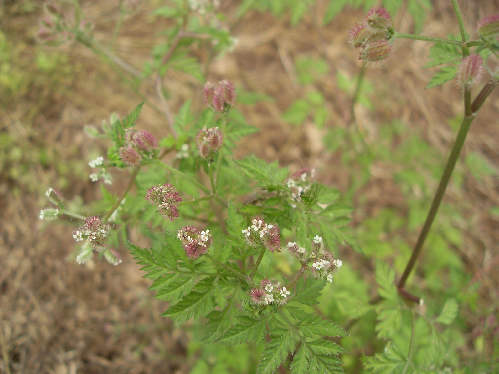

## 窃衣

---

**拉丁名:**  _Torilis japonica (Houtt.) DC_

**科 属:** 伞形科 窃衣属

**别 名:** 破子草
【形  态】一年生或两年生草本，高30～75厘米，全株有贴生硬短毛
 。根圆锥状，茎单生，向上多分枝。叶三角状卵形，长约12厘米，1
 ～2回羽状分裂；小裂片披针形至矩圆形，短渐尖或长渐尖，边缘有
 整齐的齿牙、缺刺或分裂；顶端的小裂片形较大。复伞形花序直径2
 ～4厘米，花白色，直径2毫米。果实被皮刺。花果期5～6月。
【西大分布地】仅见于南校区待开发区内。
备注：
    2009年5月17日摄于西北大学南校区待开发区内。

**原产地:** 窃 衣
详细资料： 首页 下一页 上一页
【拉丁名】Torilis japonica (Houtt.) DC.
【科 属】伞形科 窃衣属
【别 名】破子草

**形  态:** 一年生或两年生草本，高30～75厘米，全株有贴生硬短毛。根圆锥状，茎单生，向上多分枝。叶三角状卵形，长约12厘米，1～2回羽状分裂；小裂片披针形至矩圆形，短渐尖或长渐尖，边缘有整齐的齿牙、缺刺或分裂；顶端的小裂片形较大。复伞形花序直径2～4厘米，花白色，直径2毫米。果实被皮刺。花果期5～6月。

**西大分布地:** 仅见于南校区待开发区内。

**备注:** 2009年5月17日摄于西北大学南校区待开发区内。

.JPG) 

 

