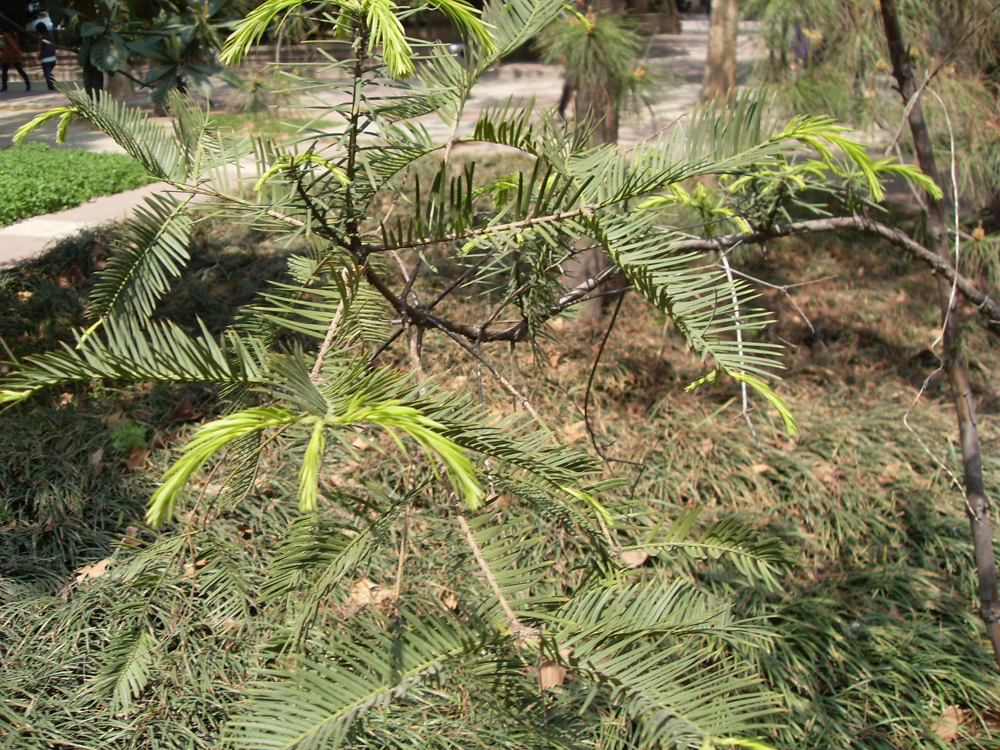

## 粗榧

---

**拉丁名:**  _Cephalotaxus sinensis (Rehder et E. H. Wilson) H. L. Li _

**科 属:** 三尖杉科 三尖杉属

**别 名:** 粗榧杉、中华粗榧杉
 【原产地】中国（特有种）
 【形  态】常绿灌木或小乔木，高达12米。树皮灰色或灰
  褐色，呈薄片状脱落。叶条形，通常直，很少微弯，端
  渐尖，长3.5厘米，宽约3毫米，先端有微急尖或渐尖的短尖
  头，基部近圆或广楔形，几无柄，上面绿色，下面气孔
  带白色，较绿色边带宽约3～4倍，花期4月：种子次年10
  月成熟。
 【西大分布地】仅见于北校区地质系楼前林下及生命科学学院
  楼南东侧。
 备注：
     2009年4月7日摄于西北大学北校区地质系楼前林下。

**原产地:** 中国（特有种）
 【形 态】常绿灌木或小乔木，高达12米。树皮灰色或灰
 褐色，呈薄片状脱落。叶条形，通常直，很少微弯，端
 渐尖，长3.5厘米，宽约3毫米，先端有微急尖或渐尖的短尖
 头，基部近圆或广楔形，几无柄，上面绿色，下面气孔
 带白色，较绿色边带宽约3～4倍，花期4月：种子次年10
 月成熟。
【西大分布地】仅见于北校区地质系楼前林下及生命科学学院
 楼南东侧。
备注：
 2009年4月7日摄于西北大学北校区地质系楼前林下。

**形  态:** 常绿灌木或小乔木，高达12米。树皮灰色或灰褐色，呈薄片状脱落。叶条形，通常直，很少微弯，端渐尖，长3.5厘米，宽约3毫米，先端有微急尖或渐尖的短尖头，基部近圆或广楔形，几无柄，上面绿色，下面气孔带白色，较绿色边带宽约3～4倍，花期4月：种子次年10月成熟。

**西大分布地:** 仅见于北校区地质系楼前林下及生命科学学院 楼南东侧。

**备注:** 2009年4月7日摄于西北大学北校区地质系楼前林下。

 

