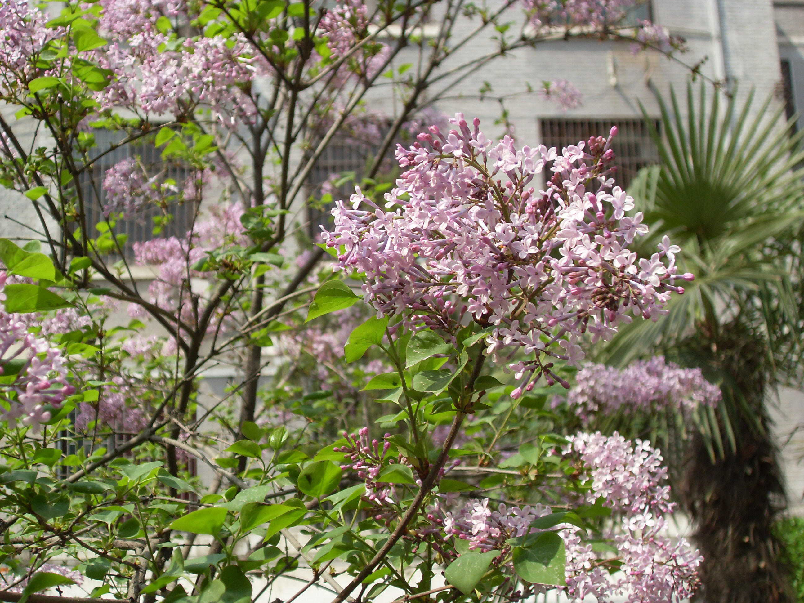

## 紫丁香

---

**拉丁名:**  _Syringa oblata Lindl_

**科 属:** 木犀科 丁香属

**别 名:** 华北紫丁香

**原产地:** 中国华北

**形  态:** 落叶灌木或小乔木，高可达7米；枝条粗长无毛。叶广卵形，通常宽度大于长度，宽5～10厘米，端锐尖，基部心形或截形，全缘，两面无毛。圆锥花序长6～15厘米；花萼钟形，有4齿；花冠堇紫色，管部长1～1.2厘米，端4裂开展蒴果长圆形，长1～2厘米，顶端尖，平滑。花期4月，果期7月。

**西大分布地:** 北校区见于行政楼前、男生宿舍前及生命科学学院后。

**备注:** 2009年3月23日摄于西北大学北校区生命科学学院后。

 

