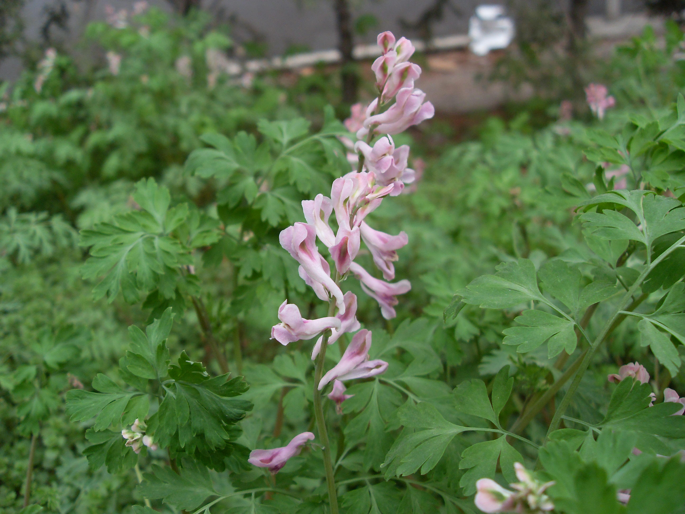

## 紫堇

---

**拉丁名:**  _Corydalis edulis Maxim. _

**科 属:** 罂粟科 紫堇属

**别 名:** 蝎子花、断肠草

**原产地:** 中国

**形  态:** 一年身细弱草本，主根明显。茎不分枝或柄基部分枝，高20～50厘米。叶片近三角形，二回羽状全裂，一回裂片2～3对，距离疏远，有柄；二回裂片近无柄，倒卵状楔形，裂片先端2～3裂齿。花紫色，3～10朵排成疏散的总状花序，花瓣连距长15～20毫米，初向上举，后平展，距长约整个花瓣的1/3，尾部微上翘，外部2瓣先端扩展，背部有狭翅，顶部稍联合。蒴果线形，种子扁球形，黑色。花果期3～6月。

**西大分布地:** 北校区常见早春杂草，见于花坛中。　

**备注:** 2009年3月11日摄于西北大学北校区艺术学院楼后。

 

