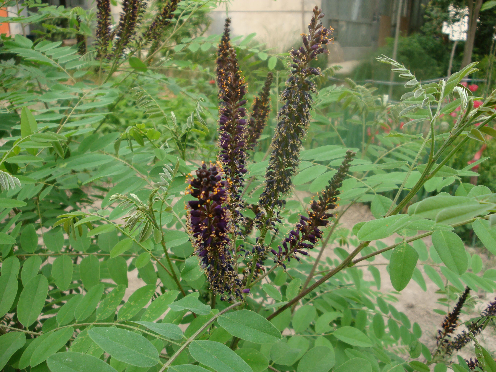

## 紫穗槐

---

**拉丁名:**  _Amorpha fruticosa Linn_

**科 属:** 豆科 紫穗槐属

**别 名:** 棉槐

**原产地:** 北美洲

**形  态:** 丛生落叶灌木，高1～4米，枝条直伸，青灰色，幼时有毛；芽常2个叠生。奇数羽状复叶，叶长10～15厘米，小叶11～25枚，披针状椭圆形或椭圆形，长2～4厘米，具透明油腺点，幼叶密被毛，老叶毛稀疏；托叶小。花小，蓝紫色，花药黄色，成顶生密总状花序。荚果短镰形，长7～9毫米，密被隆起油腺点。花期5～6月，果期9～10月。

**西大分布地:** 仅见于北校区西大花园内

**备注:** 2009年5月4日摄于西北大学北校区西大花园内。　　

.JPG) 

 

