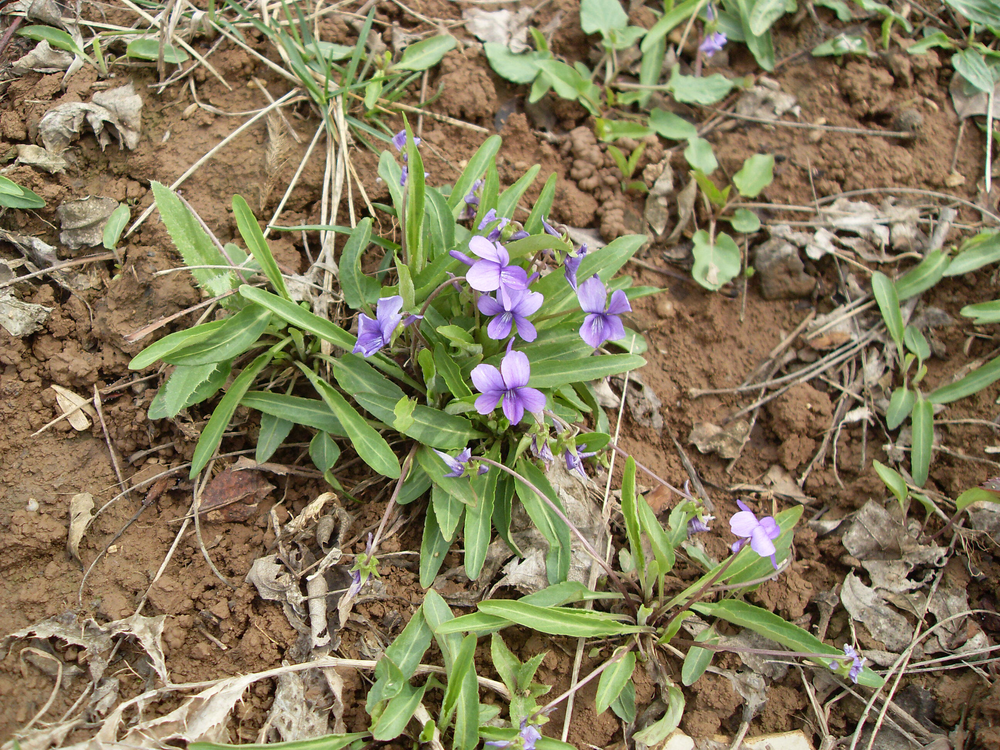
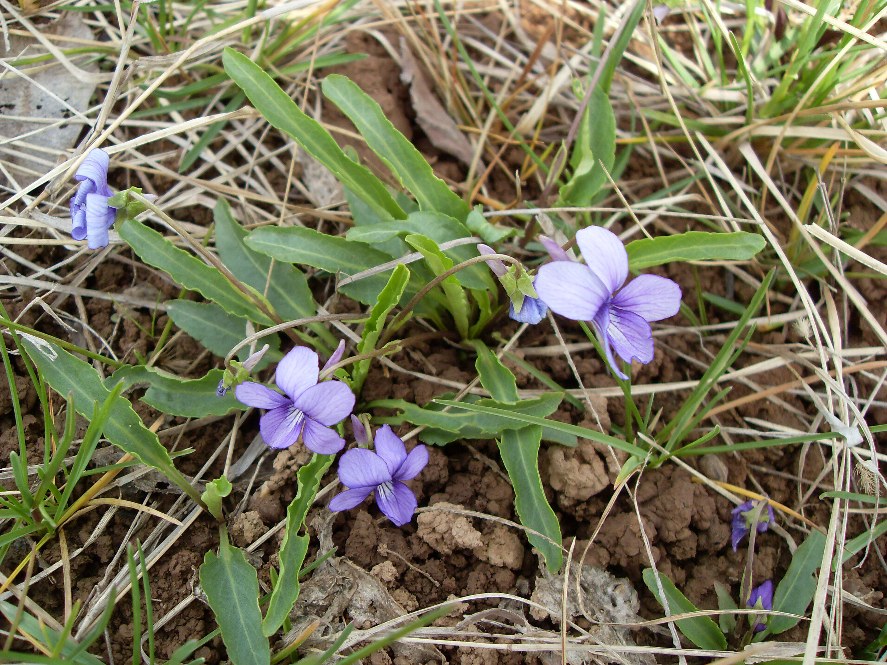

## 紫花地丁

---

**拉丁名:**  _Viola philippica Cav_

**科 属:** 堇菜科 堇菜属

**别 名:** 箭头草、光瓣堇菜

**原产地:** 中国

**形  态:** 多年生草本，高7～14厘米，无地上茎，地下茎很短，主根较粗。叶基生，狭披针形或卵状披针形，边缘具圆齿，叶柄具狭翅，托叶钻状三角形，有睫毛。花有卡柄，萼片卵状披针形，花瓣紫堇色，具细管状，直或稍上弯；花期4～5月，紫色小花，秋后茎叶仍青绿如初，花旁伴有针状小果。

**西大分布地:** 早春野花，见于南校区荒草丛中。

**备注:** 2009年3月29日摄于西北大学南校区北门附近草丛中。　

 

 

