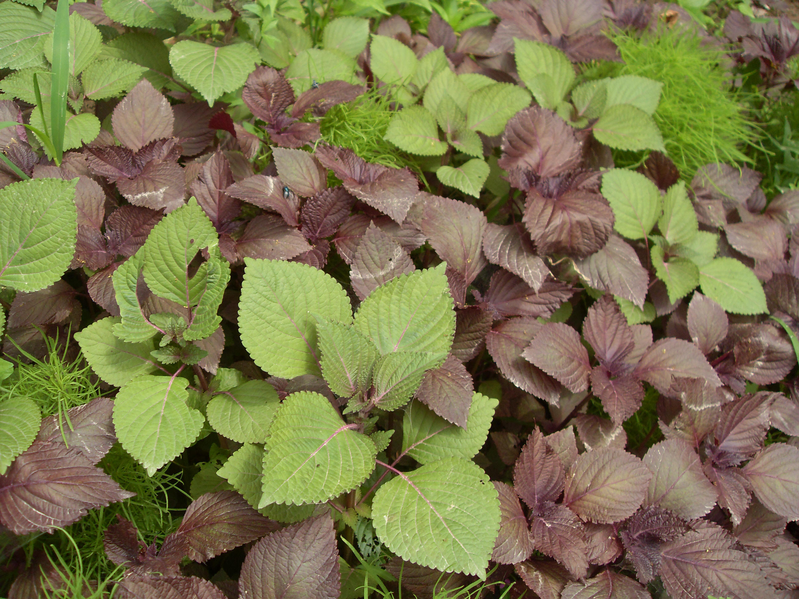

## 紫苏

---

**拉丁名:**  _Perilla frutescens (Linn.) Britt_

**科 属:** 唇形科 紫苏属

**别 名:** 赤苏、红苏、

**原产地:** 中国

**形  态:** 一年生草本，紫苏高60～180厘米，有特异芳香。茎四棱形，紫色、绿紫色或绿色，有长柔毛，以茎节部较密。单叶对生；叶片宽卵形或圆卵形，长7～21厘米，宽4．5～16厘米，基部圆形或广楔形，先端渐尖或尾状尖，边缘具粗锯齿，两面紫色，或面青背紫，或两面绿色，上面被疏柔毛，下面脉上被贴生柔毛；轮伞花序2花，组成顶生和腋生的假总状花序；花冠紫红色、粉红色至白色；2唇形，上唇微凹，下唇3裂。小坚果近球形。

**西大分布地:** 见于北校区西大花园内。

**备注:** 2009年5月30日摄于西北大学北校区西大花园内。

.JPG) 

 

