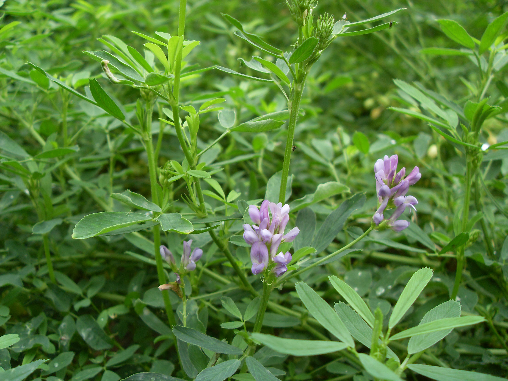

## 紫苜蓿

---

**拉丁名:**  _Medicago sativa Linn_

**科 属:** 豆科 苜蓿属

**别 名:** 苜蓿、紫花苜蓿

**原产地:** 欧洲及亚洲中部

**形  态:** 多年生草本，茎直立或铺散，多分枝，高30～100厘米。小叶倒卵形或倒披针形，长1～2.5厘米，宽3～7毫米；托叶大，披针形。总状花序腋生，长1～2.5厘米，具5～30朵花，总花梗挺直，比叶长；花蝶形，花冠淡黄色、深蓝色或暗紫色。荚果，种子卵形，黄褐色。花果期5～8月。

**西大分布地:** 仅见于北校区西大花园内。

**备注:** 2009年5月13日摄于西北大学北校区西大花园内。

.JPG) 

 

