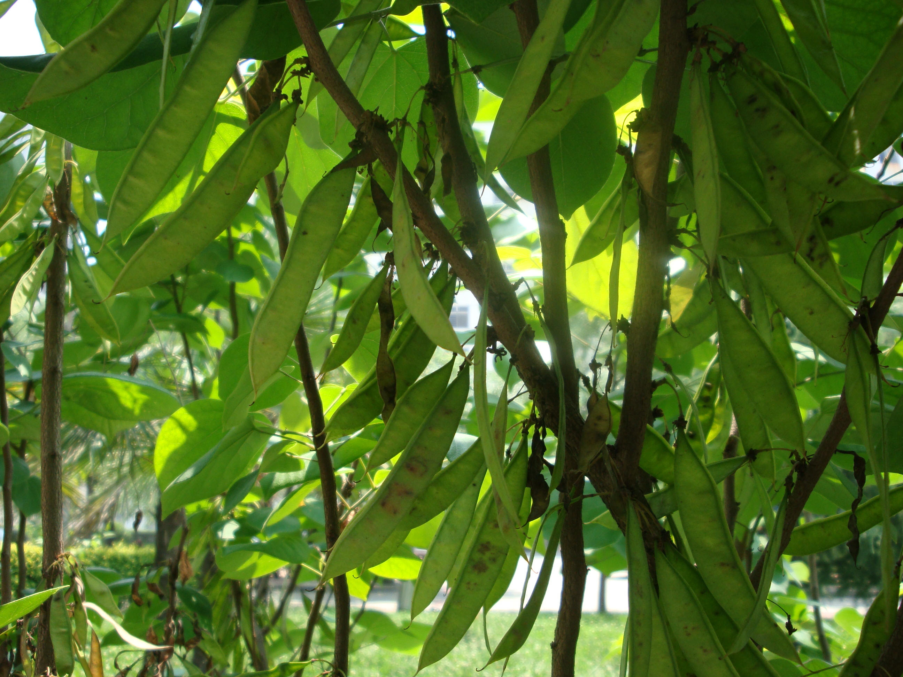

## 紫荆

---

**拉丁名:**  _Cercis chinensis Bunge_

**科 属:** 豆科 紫荆属

**别 名:** 满条红

**原产地:** 中国

**形  态:** 落叶乔木，有时栽培成灌木，状高达15米。叶近圆形，长6～14厘米，叶端急尖，叶基心形，全缘，两面无毛。花紫红色，先叶开放，4～10朵簇生于老枝上，长1～1.8厘米。荚果扁带形，顶端稍稍收缩有短喙，沿腹缝线的边上有狭翅，长4～8厘米，宽1.3厘米，种子圆形而扁，近黑色，长约4毫米。花期4月，过熟期10月。　　　

**西大分布地:** 北校区集中于西大医院北侧草坪，南校区散见于各处  

**备注:** 上图为紫荆花枝，2009年3月22日摄于西北大学北校区西大医院北侧草坪；左图为紫荆荚果，2009年5月25日摄于西北大学北校区西大医院北侧草坪。

 

 

