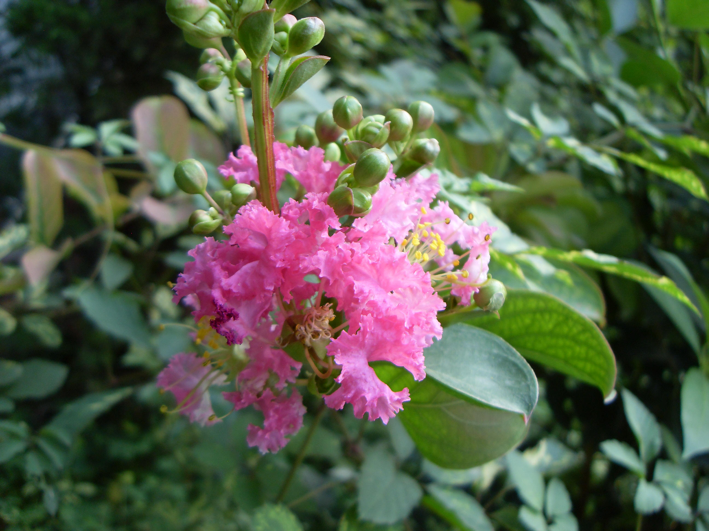

## 紫薇

---

**拉丁名:**  _Lagerstroemia indica Linn _

**科 属:** 千屈菜科 紫薇属

**别 名:** 痒痒树
 【原产地】亚洲南部、澳洲北部
 【形  态】落叶灌木或小乔木，高达7米，树冠不整齐，枝
  干多扭曲；树皮淡褐色，薄片状剥落后干特别光滑。小枝
  四棱无毛。叶对生或近对生，椭圆形至倒卵状椭圆形，长
  3～7厘米，先端尖或钝，基部广楔形或圆形，全缘。花鲜
  淡红色，径3～4厘米，花瓣6；成顶生圆锥花序。蒴果近球
  形，径约1.2厘米，6裂瓣。花期6～9月，果期10～11月。
【西大分布地】北校区见于图书馆前及生命科学学院前后。
备注：
    2009年7月5日摄于西北大学北校区生命科学学院楼后。

**原产地:** 亚洲南部、澳洲北部
【形 态】落叶灌木或小乔木，高达7米，树冠不整齐，枝
 干多扭曲；树皮淡褐色，薄片状剥落后干特别光滑。小枝
 四棱无毛。叶对生或近对生，椭圆形至倒卵状椭圆形，长
 3～7厘米，先端尖或钝，基部广楔形或圆形，全缘。花鲜
 淡红色，径3～4厘米，花瓣6；成顶生圆锥花序。蒴果近球
 形，径约1.2厘米，6裂瓣。花期6～9月，果期10～11月。
【西大分布地】北校区见于图书馆前及生命科学学院前后。
备注：
 2009年7月5日摄于西北大学北校区生命科学学院楼后。

**形  态:** 落叶灌木或小乔木，高达7米，树冠不整齐，枝干多扭曲；树皮淡褐色，薄片状剥落后干特别光滑。小枝四棱无毛。叶对生或近对生，椭圆形至倒卵状椭圆形，长3～7厘米，先端尖或钝，基部广楔形或圆形，全缘。花鲜淡红色，径3～4厘米，花瓣6；成顶生圆锥花序。蒴果近球形，径约1.2厘米，6裂瓣。花期6～9月，果期10～11月。

**西大分布地:** 北校区见于图书馆前及生命科学学院前后。

**备注:** 2009年7月5日摄于西北大学北校区生命科学学院楼后。

 

