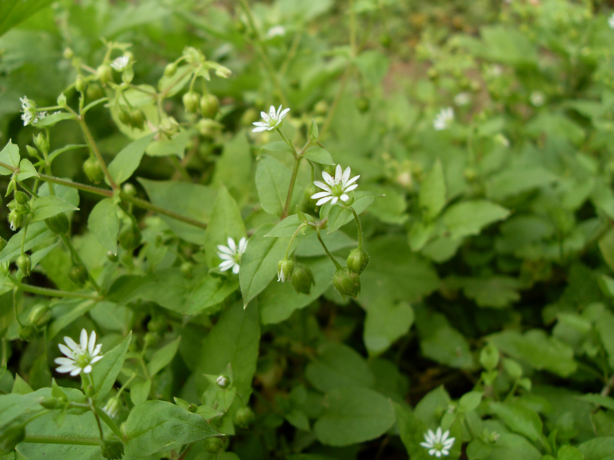

## 繁缕

---

**拉丁名:**  _Stellaria media(l.) Cyr_

**科 属:** 石竹科 繁缕属

**别 名:** 鹅儿肠
【形  态】直立或平铺一年生草本。茎纤细，蔓延地上。上
 部叶卵形，长0.5～2.5厘米，常有缘尖，基部圆形，无柄；
 下部叶卵形或心形，有长柄。花单生叶腋或组成顶生疏散
 的聚伞花序，花梗纤细；花瓣10枚，白色。蒴果长圆形或
 卵圆形。种子圆形，黑褐色，密生疣状突起。花期2～4月，
 果期5～6月。
【西大分布地】常见杂草，三校区均有分布。
　
 备注：
     2008年10月12日摄于西北大学北校区西大花园。

**原产地:** 繁 缕
详细资料： 首页 下一页 上一页
【拉丁名】Stellaria media(l.) Cyr.
【科 属】石竹科 繁缕属
【别 名】鹅儿肠

**形  态:** 直立或平铺一年生草本。茎纤细，蔓延地上。上部叶卵形，长0.5～2.5厘米，常有缘尖，基部圆形，无柄；下部叶卵形或心形，有长柄。花单生叶腋或组成顶生疏散的聚伞花序，花梗纤细；花瓣10枚，白色。蒴果长圆形或卵圆形。种子圆形，黑褐色，密生疣状突起。花期2～4月，果期5～6月。

**西大分布地:** 常见杂草，三校区均有分布。　

**备注:** 2008年10月12日摄于西北大学北校区西大花园。

 

