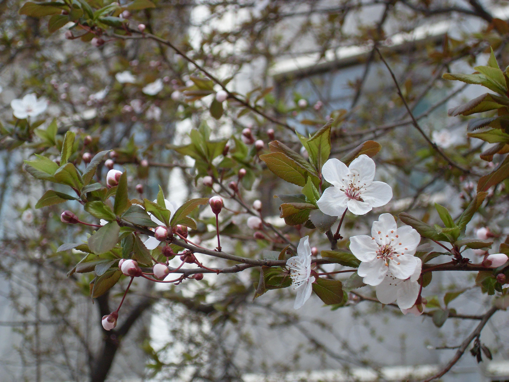
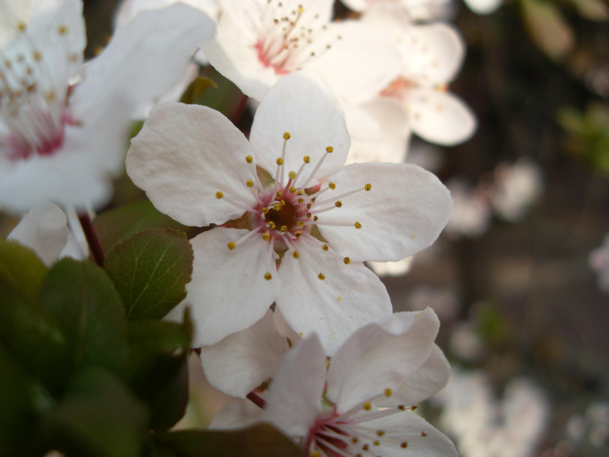
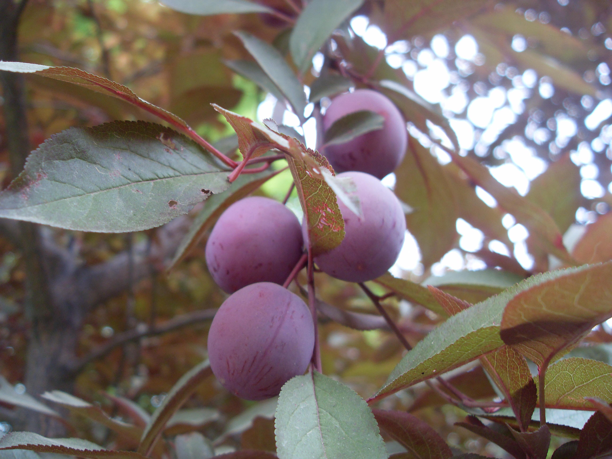

## 红叶李

---

**拉丁名:**  _Prunus cerasifera Ehrh.f.atropurpurea (Jacg) Rehd_

**科 属:** 蔷薇科 李属

**别 名:** 紫叶李

**原产地:** 亚洲西南

**形  态:** 落叶小乔木，高达8米。小枝光滑。叶卵形至倒卵形，长3～4.5厘米，基部圆形，重锯齿尖细，紫红色，背部中脉基部有柔毛。花淡粉红色，5瓣，径约2.5厘米，常单生；花梗长1.5～2厘米。果球形，暗酒红色。花期3～4月，果期6月。　　　　

**西大分布地:** 北校区见于图书馆前几化工学院北侧及生科院楼后；

**备注:** 上图为红叶李花枝，2009年3月17日摄于西北大学北校区化工学院北侧；左图为红叶李果实，2009年5月8日摄于西北大学北校区生科院楼后。

 

 

 

