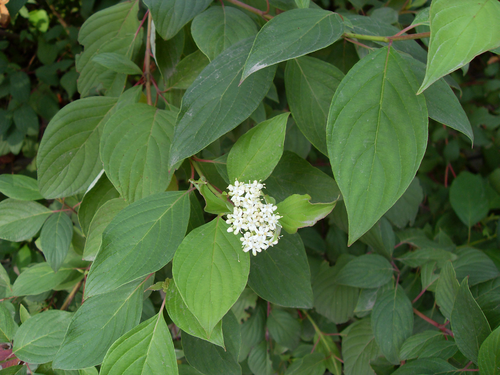
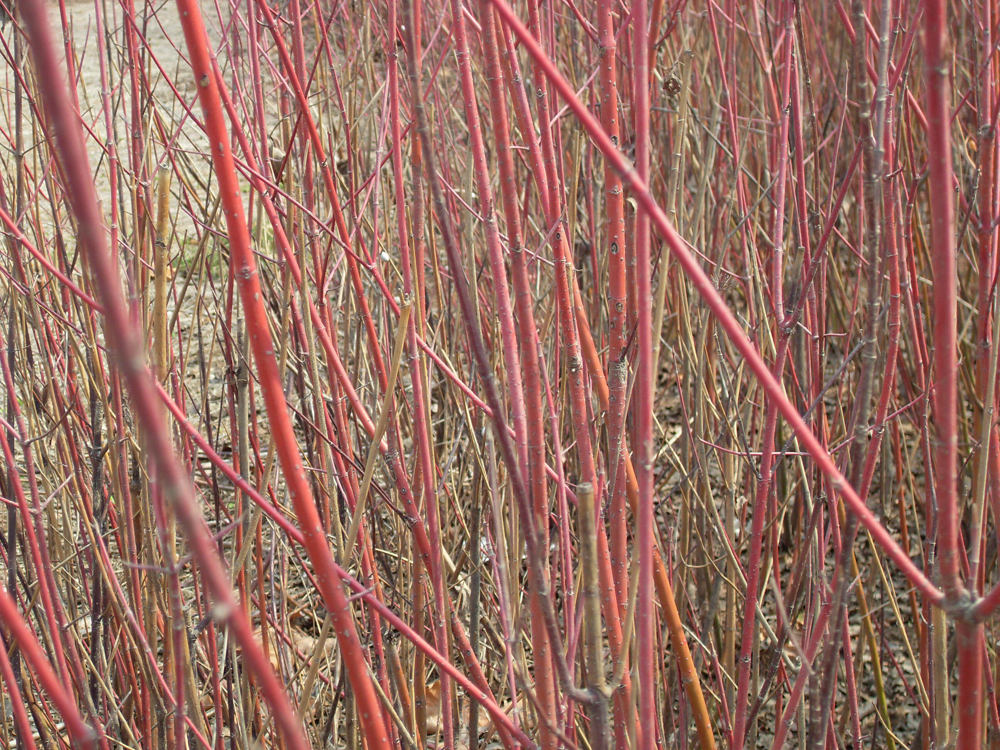
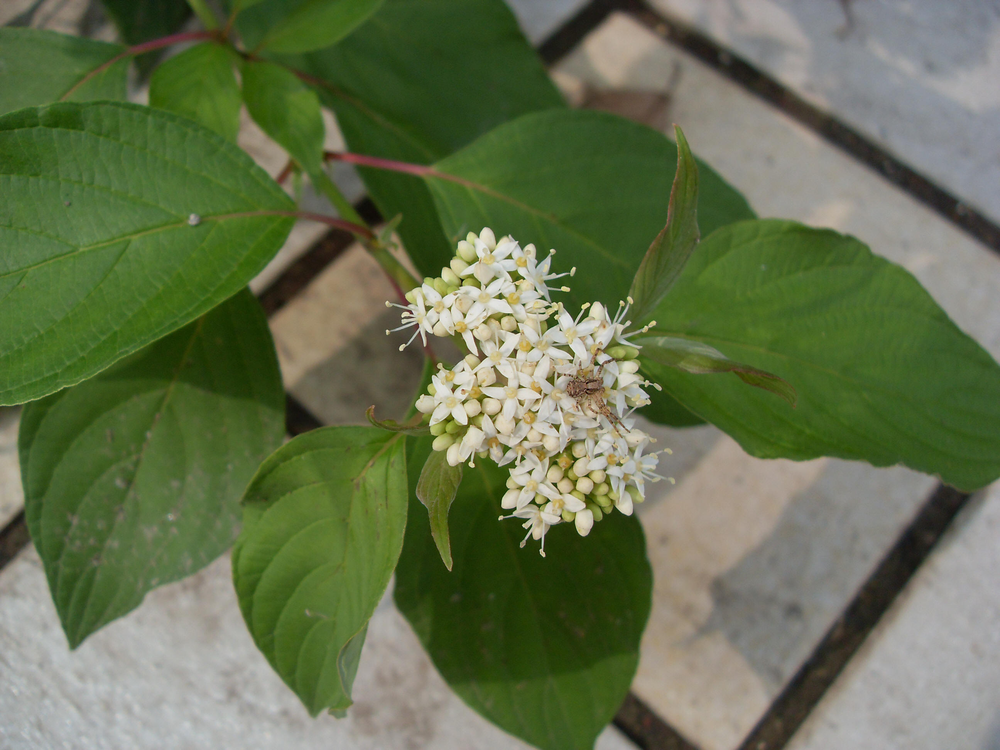

## 红瑞木

---

**拉丁名:**  _Cornus alba L_

**科 属:** 山茱萸科 棶木属

**别 名:** 红柳、凉子木

**原产地:** 中国、朝鲜、俄罗斯

**形  态:** 落叶灌木，高达3米。枝血红色，无毛，初时常被白粉。叶对生，卵形或椭圆形，长4～9厘米，叶端尖，叶基部圆形或广楔形，全缘，叶表暗绿色，叶被粉绿色，两面均疏生贴生柔毛。花小，黄白，色排成顶生伞房状聚伞花序。核果斜卵圆形，成熟时白色或稍带蓝色。花期5～6月，果期8～9月。　　　

**西大分布地:** 分布于南校区中央报告厅南侧门口左右及南门外绿化带。  

**备注:** 上图为红瑞木花枝，摄于2008年10月18日西北大学南校区中央报告厅南侧门口下图为红瑞木具有特点的血红色枝干摄于2009年2月28日西北大学南校区中央报告厅南侧门口。　

 

 

 

