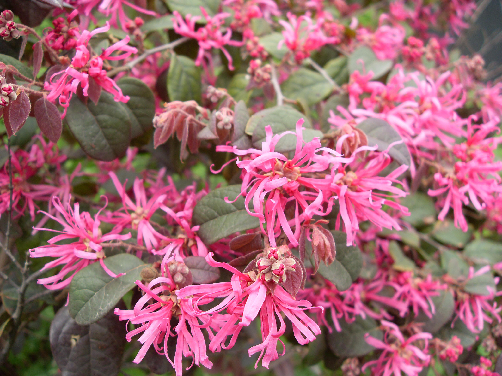

## 红花檵木

---

**拉丁名:**  _Loropetalum chinense (R. Br.) Oliver var. rubrum Yieh _

**科 属:** 金缕梅科 檵木属

**别 名:** 红桎木、红檵花

**原产地:** 中国长江中下游及以南地区，印度北部 

**形  态:** 常绿灌木或小乔木。嫩枝被暗红色星状毛。叶互生，革质，卵形，全缘，嫩枝淡红色，越冬老叶暗红色。花4～8朵簇生于总状花梗上，呈顶生头状或短穗状花序，花瓣4枚，淡紫红色，带状线形。蒴果木质，倒卵圆形；种子长卵形，黑色，光亮。花期4～5月，果期9～10月。

**西大分布地:** 仅见于北校区北门口中央花坛。

**备注:** 2009年3月29日摄于西北大学北校区北门口中央花坛。　

.JPG) 

 

