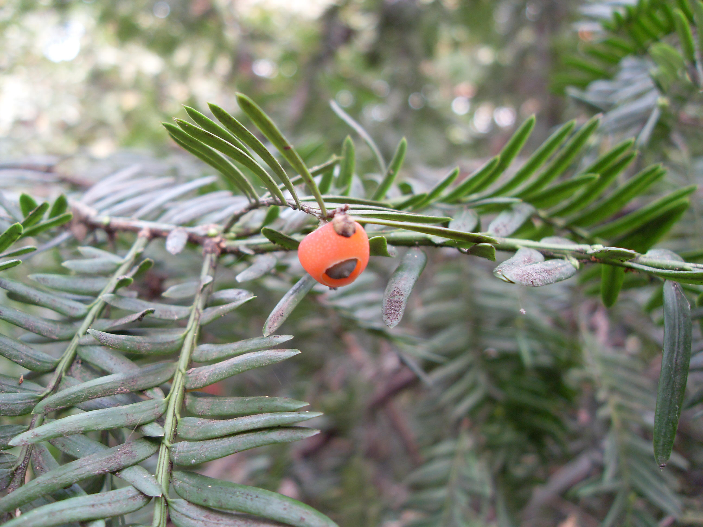

## 红豆杉

---

**拉丁名:**  _Taxus chinensis(Pliger) Rehd_

**科 属:** 红豆杉科 红豆杉属

**别 名:** 观音杉

**原产地:** 中国西南部

**形  态:** 常绿乔木，高30米，干径达1米。叶螺旋状互生，基部扭转成两列，条形，长1～2.5厘米，宽2～2.5毫米，叶端渐尖。雌雄异株，雄球花单生于叶腋，圆球形，淡黄色；雌球花的胚珠单生于花轴上部侧生短轴的顶端，基部有圆盘状假果皮，杯状，红色。种子扁卵圆形，有2棱。种脐卵圆形。

**西大分布地:** 仅见于北校区西大花园内。　

**备注:** 2008年10月12日摄于西北大学北校区西大花园内。

 

