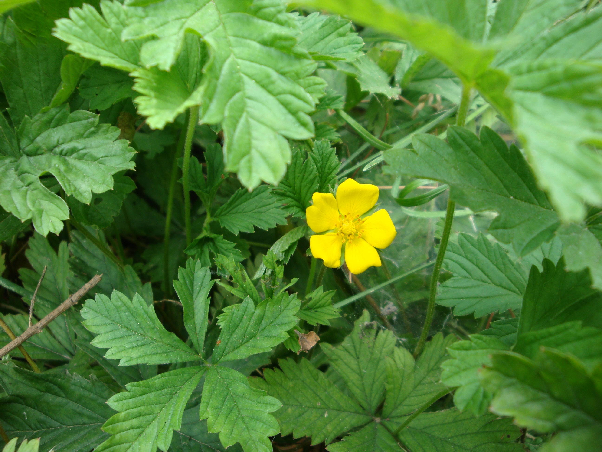

## 绢毛匍匐委陵菜

---

**拉丁名:**  _Potentilla reptans Linn. var. sericophylla Franch _

**科 属:** 蔷薇科 委陵菜属

**别 名:** 五爪龙、金金棒
 【原产地】中国
 【形  态】多年生草本，茎匍匐，节上常生根，被伏柔毛
  。基生叶有长柄，3出掌状复叶，小叶无柄或近于无柄，倒
  卵形或菱状倒卵形，长1～2厘米，宽6～10毫米，边缘于中
  部以上具有粗锯齿，表面具有伏生柔毛，背面有绢毛；茎生
  叶具短柄，小叶3，披针形，有柔毛。花单生，花梗纤细；花
  瓣黄色，倒心形。花期4～8月。
 【西大分布地】见于北校区生命科学学院楼后林下及地质系楼前林下。
备注：
    2009年6月15日摄于西北大学北校区生命科学学院楼后林下。

**原产地:** 中国
 【形 态】多年生草本，茎匍匐，节上常生根，被伏柔毛
 。基生叶有长柄，3出掌状复叶，小叶无柄或近于无柄，倒
 卵形或菱状倒卵形，长1～2厘米，宽6～10毫米，边缘于中
 部以上具有粗锯齿，表面具有伏生柔毛，背面有绢毛；茎生
 叶具短柄，小叶3，披针形，有柔毛。花单生，花梗纤细；花
 瓣黄色，倒心形。花期4～8月。
【西大分布地】见于北校区生命科学学院楼后林下及地质系楼前林下。
备注：
 2009年6月15日摄于西北大学北校区生命科学学院楼后林下。

**形  态:** 多年生草本，茎匍匐，节上常生根，被伏柔毛。基生叶有长柄，3出掌状复叶，小叶无柄或近于无柄，倒卵形或菱状倒卵形，长1～2厘米，宽6～10毫米，边缘于中部以上具有粗锯齿，表面具有伏生柔毛，背面有绢毛；茎生叶具短柄，小叶3，披针形，有柔毛。花单生，花梗纤细；花瓣黄色，倒心形。花期4～8月。

**西大分布地:** 见于北校区生命科学学院楼后林下及地质系楼前林下。

**备注:** 2009年6月15日摄于西北大学北校区生命科学学院楼后林下。

.JPG) 

 

