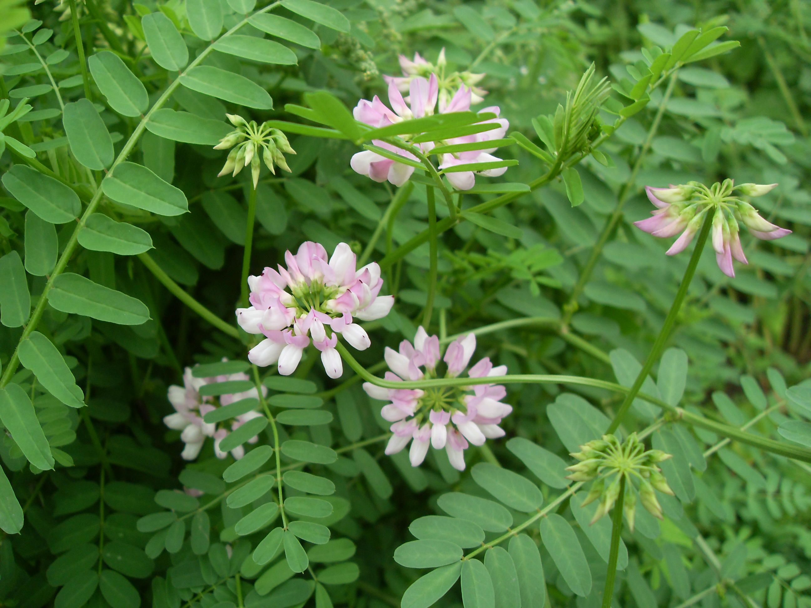

## 绣球小冠花

---

**拉丁名:**  _Coronilla varia Linn_

**科 属:** 豆科 小冠花属

**别 名:** 多变小冠花

**原产地:** 地中海地区

**形  态:** 多年生草本，茎直立，多分枝，舒展，高50～100厘米。茎、小枝具条棱。奇数羽状复叶，具小叶11～17，椭圆形或长圆形，长15～25毫米，宽4～8毫米，先端具短尖头，基部近圆形。伞形花序腋生，花10～20朵密集排列成绣球状；花冠淡紫色、淡红色或白色。荚果细长，圆柱形。种子长圆状倒卵形，光滑，黄褐色。花期6～7月，果期8～9月。

**西大分布地:** 仅见于北校区西大花园内。

**备注:** 2009年5月13日摄于西北大学北校区西大花园内。

.JPG) 

 

