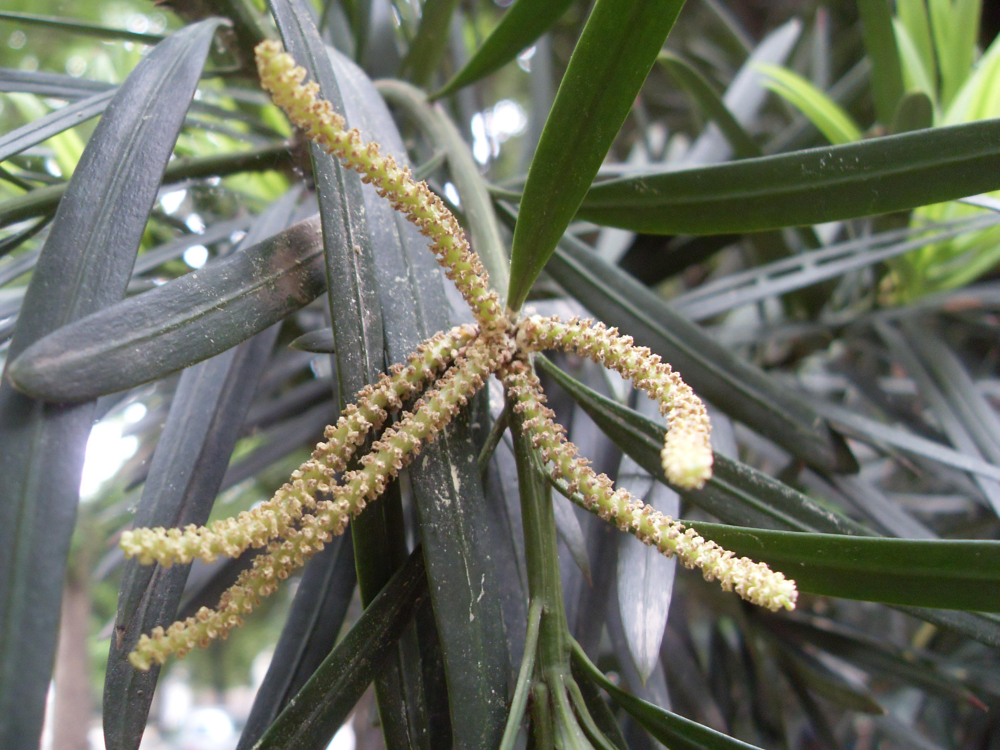

## 罗汉松

---

**拉丁名:**  _Podocarpus macrophyllus (Thunb.) D.Don_

**科 属:** 罗汉松科 罗汉松属

**别 名:** 罗汉杉、土杉

**原产地:** 中国南部及日本

**形  态:** 常绿乔木，高达20米，树冠广卵形，树皮灰色，浅裂，呈薄鳞片状脱落。枝较短而横斜密生。叶条状披针形，长7～12厘米，宽7～10毫米，叶端尖，叶表暗绿色，有光泽，叶被淡绿或粉绿，叶螺旋状互生。雄球花3～5簇生叶腋，圆柱形，3～5厘米；雌球花单生叶腋。种子卵形，长约1厘米，熟时紫色，外被白粉，着生于膨大的种拖上，种托肉质，椭圆形，初时深红色，后变紫色，略有甜味。花期4～5月，种子8～11月成熟。　　　

**西大分布地:** 见于北校区文博学院前东侧及经管学院东侧草坪上。

**备注:** 上图为罗汉松单株树型，2009年5月13日摄于西北大学北校区文博学院前东侧；左图为罗汉松雄球花，2009年5月13日摄于西北大学北校区文博学院前东侧。

.JPG) 

 

