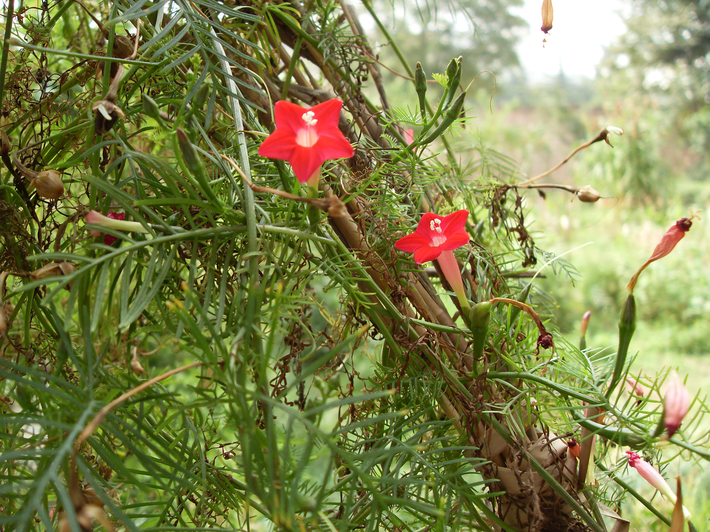
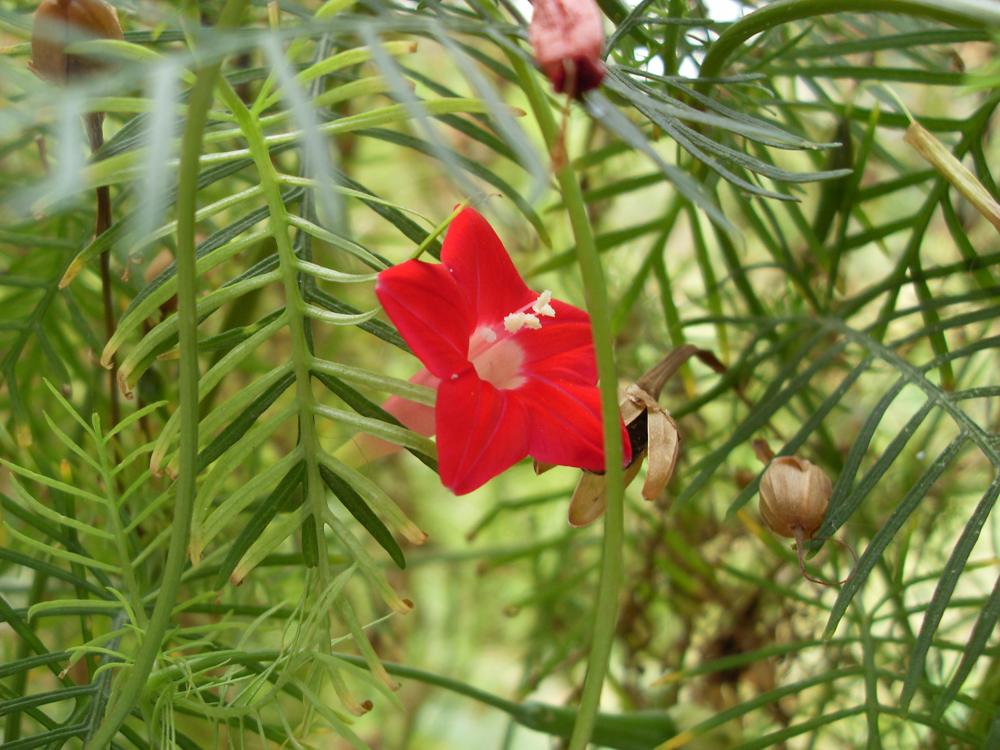

## 羽叶茑萝

---

**拉丁名:**  _Quamoclit pennata(Desr.) Boj_

**科 属:** 旋花科 茑萝属

**别 名:** 茑萝松

**原产地:** 美洲热带

**形  态:** 一年生柔弱缠绕草本，蔓长6～7米。叶卵形或长圆形，羽状深裂至中脉，有10～18对线形至丝状的平展细裂片，叶柄基部有假托叶。聚伞花序腋生着花1至数朵，花径1.5～2厘米，花冠鲜红色，高脚碟状，呈五角星形，筒部细长。蒴果卵形，种子4枚，卵状长圆形，黑褐色。花期7～9月，果期8～10月。

**西大分布地:** 偶见于三校区，多分布于北校区西大花园内。

**备注:** 2008年9月22日摄于西北大学北校区西大花园内。　

 

 

