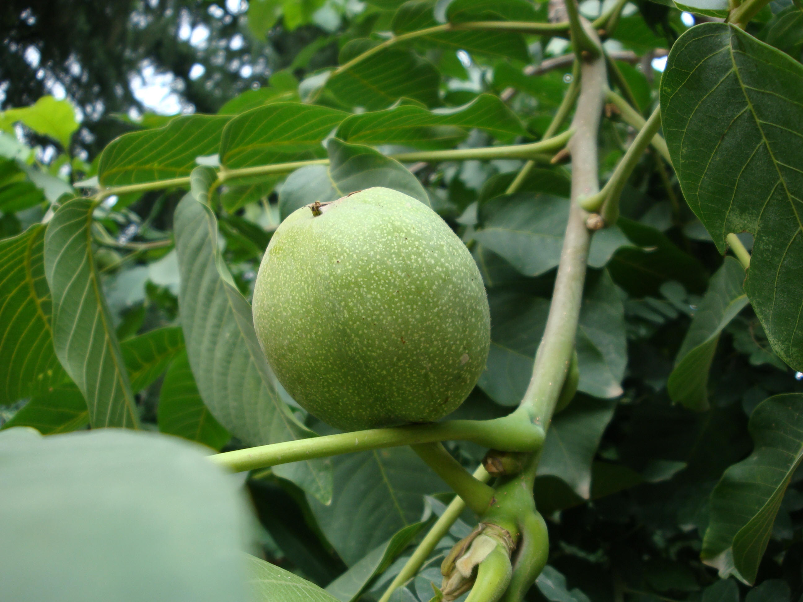
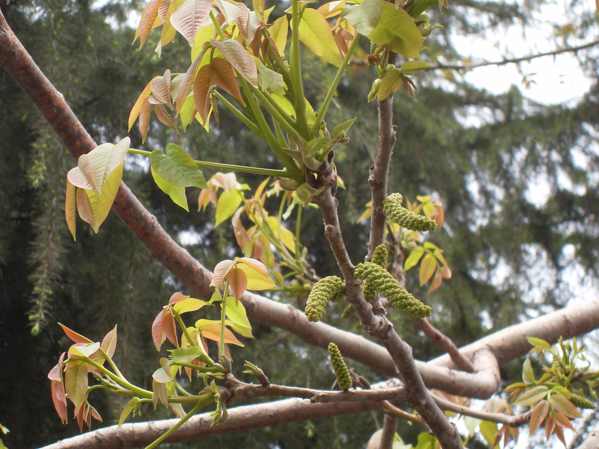

## 胡桃

---

**拉丁名:**  _Juglans regia Linn_

**科 属:** 胡桃科 胡桃属

**别 名:** 核桃

**原产地:** 中国新疆及阿富汗、伊朗一带

**形  态:** 落叶乔木，高达30米，胸径1米。树冠广卵形至扁球形。树皮灰白色，老时深纵裂。1年生枝绿色，无毛或近无毛。小叶5～9，椭圆形、卵状椭圆形至倒卵形，长6～14厘米，基部钝圆或偏斜，全缘，表边光滑，幼叶背面有油腺点。雄花为柔荑花序，生于上年枝上；雌花1～5朵成顶生穗状花序。核果球形，径4～5厘米，果核近球形，先端钝，有不规则浅刻纹及纵脊。花期4～5月，果期9～11月。　　　

**西大分布地:** 仅见于北校区西大花园内。 

**备注:** 上图为胡桃雄花序，2009年3月28日摄于西北大学北校区西大花园内；左图为胡桃果实，2009年6月15日摄于西北大学北校区西大花园内。

 

 

