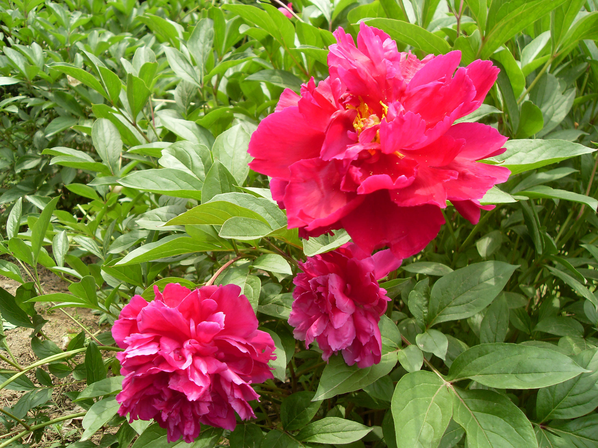

## 芍药

---

**拉丁名:**  _Paeonia lactiflora Pall. _

**科 属:** 芍药科 芍药属

**别 名:** 殿春、婪尾春、将离

**原产地:** 中国

**形  态:** 多年生草本，肉质根。高约50～110厘米，茎基部圆柱形，上部多棱角，向阳部分多成紫红晕。叶为2回3出羽状复叶，长20～24厘米，小叶椭圆形、狭卵形或披针形，叶端长而尖。花独开于茎的顶端或近顶端叶腋处；花大，直径达10～20厘米，有单瓣、复瓣和重瓣；花色丰富。果实为蓇葖果，种子黑色，呈圆形。花期4～5月，果期7～8月。　　　

**西大分布地:** 北校区见于图书馆前花坛及西大花园内。 南校区见于中央报告厅楼顶。 

**备注:** 上图为芍药一蔷薇型红花品种，摄于2009年4月27日西北大学北校区图书馆前；左图为芍药一皇冠型白花品种，摄于2009年4月27日西北大学北校区图书馆前。

.JPG) 

.JPG) 

 

