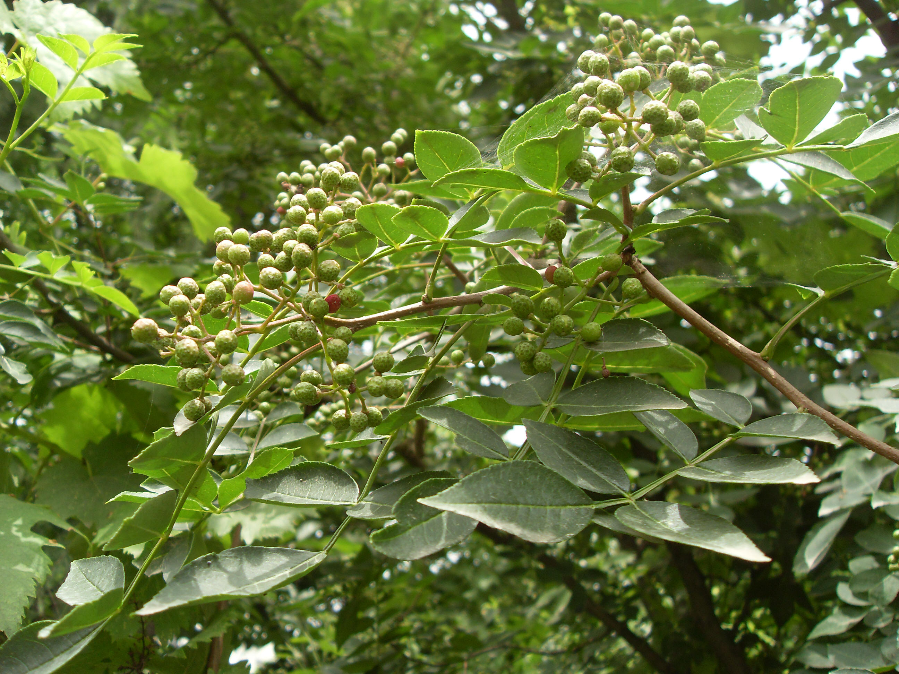

## 花椒

---

**拉丁名:**  _Zanthoxylum bungeanum Maxim_

**科 属:** 芸香科 花椒属

**别 名:** 香椒、大花椒、青椒、麻椒

**原产地:** 中国

**形  态:** 落叶灌木或小乔木。树皮灰色上有许多瘤状突起。奇数羽状复叶，互生；小叶5～11枚，卵状长椭圆形，边缘有细钝齿。聚伞状圆锥花序顶生，单性或杂性同株。蓇葖果球形果皮有疣状突起，红色至紫红色。种子黑色，有光泽。花期5月，果期7～8月。

**西大分布地:** 北校区见于西大花园内。

**备注:** 2009年5月30日摄于西北大学北校区西大花园内。　

.JPG) 

 

