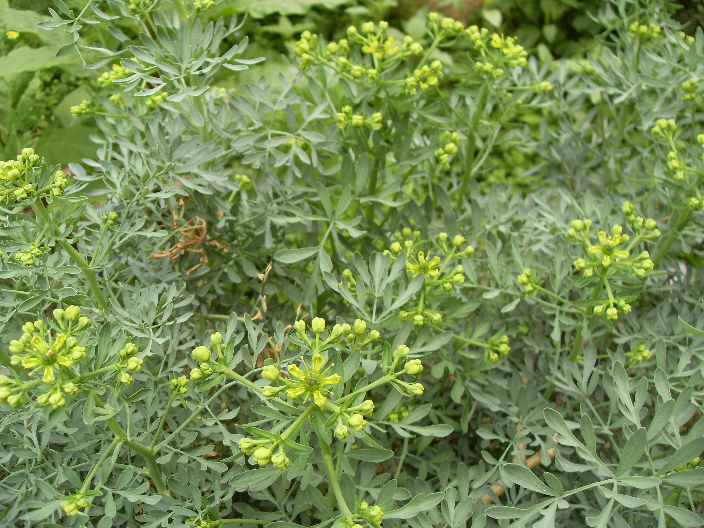

## 芸香

---

**拉丁名:**  _Ruta graveolens Linn_

**科 属:** 芸香科 芸香属

**别 名:** 臭草、小香草

**原产地:** 南欧

**形  态:** 多年生带木质的草本，茎直立，高达1米。绿白色，无毛，具强烈的刺激性气味。叶为2回至3回的羽状复叶，或分裂叶，裂片倒卵状矩圆形、倒卵形或匙形，全缘或微有钝齿。花金黄色，直径约2厘米，顶生聚伞花序，花瓣4～5；花开初时雄蕊与花瓣对生的4枚贴伏于花瓣，花盛开时全部雄蕊并列一起伸直，等长；花盘有腺点，果长6～10毫米，有顶端裂至中部，表面有油腺，种子甚多。花期5～6月，果期6～7月。

**西大分布地:** 仅见于北校区西大花园内。

**备注:** 2009年5月4日摄于西北大学北校区西大花园内。

.JPG) 

 

