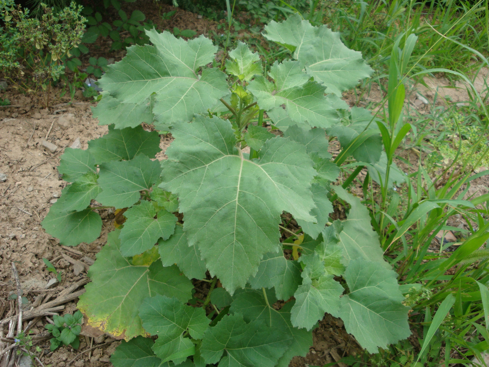
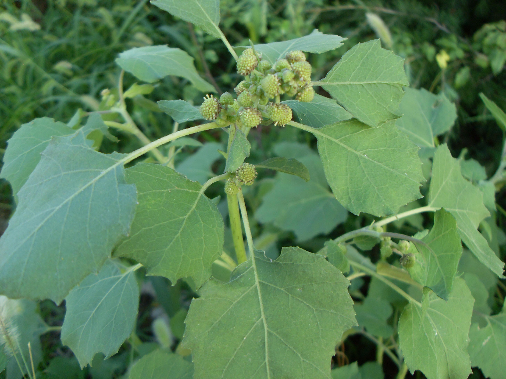

## 苍耳

---

**拉丁名:**  _Xanthium sibiricum Patrin ex Widder  _

**科 属:** 菊科 向日葵族 苍耳属

**别 名:** 虱麻头
 【形  态】一年生草本，高20～90厘米。茎直立不分枝或
  少有分枝，下部圆柱形，上部有纵沟，被灰白色糙伏毛，叶
  三角状卵形或心形，长4～9厘米基础3脉。雄头状花序球形
  ，密生柔毛；雌头状花序椭圆形，内层总苞片结合成囊状。
  瘦果总苞坚硬，外面疏生有钩的总苞刺。花果期7～11月。
 【西大分布地】常见杂草，见于三校区各处。
备注：
    2009年6月17日摄于西北大学南校区待开发区。
  

**原产地:** 苍 耳
详细资料： 首页 下一页 上一页
【拉丁名】Xanthium sibiricum Patrin ex Widder 
【科 属】菊科 向日葵族 苍耳属
【别 名】虱麻头
 【形 态】一年生草本，高20～90厘米。茎直立不分枝或
 少有分枝，下部圆柱形，上部有纵沟，被灰白色糙伏毛，叶
 三角状卵形或心形，长4～9厘米基础3脉。雄头状花序球形
 ，密生柔毛；雌头状花序椭圆形，内层总苞片结合成囊状。
 瘦果总苞坚硬，外面疏生有钩的总苞刺。花果期7～11月。
【西大分布地】常见杂草，见于三校区各处。
备注：
 2009年6月17日摄于西北大学南校区待开发区。
 

**形  态:** 一年生草本，高20～90厘米。茎直立不分枝或少有分枝，下部圆柱形，上部有纵沟，被灰白色糙伏毛，叶三角状卵形或心形，长4～9厘米基础3脉。雄头状花序球形，密生柔毛；雌头状花序椭圆形，内层总苞片结合成囊状。瘦果总苞坚硬，外面疏生有钩的总苞刺。花果期7～11月。

**西大分布地:** 常见杂草，见于三校区各处。

**备注:** 2009年6月17日摄于西北大学南校区待开发区。

 

 

