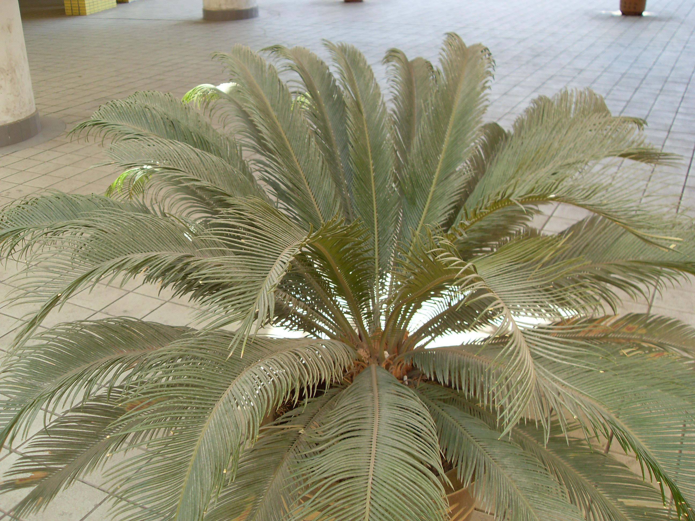

## 苏铁

---

**拉丁名:**  _Cycas revoluta Thunb _

**科 属:** 苏铁科 苏铁属

**别 名:** 铁树、凤尾松、避火蕉
 【原产地】中国南部、日本、印尼及菲律宾
 【形  态】常绿乔木，高可达20米。茎干园柱状，不分枝。
  茎部密被宿存的叶基和叶痕，并呈鳞片状。叶从茎顶部生出，
  羽状复叶，大型。小叶线形，初生时内卷，后向上斜展，微
  呈“V”字形，边缘显著向下反卷，厚革质，坚硬，有光泽，
  先端锐尖，叶背密生锈色绒毛，基部小叶成刺状。雌雄异株，
  6-8月开花，雄球花圆柱形，黄色，密被黄褐色绒毛，直立于
  茎顶；雌球花扁球形，上部羽状分裂，其下方两侧着生有2-4
  个裸露的胚球。种子10月成熟，种子大，
　
　
                                                                    【西大分布地】仅见于南校区教学楼内。
                                                                     备注：
                                                                         上图为苏铁植株，2009年3月12日摄于西北大学南校区教学楼内；
                                                                         左图为苏铁雌花球，2008年11月摄于秦始皇兵马俑一号坑外。    

**原产地:** 中国南部、日本、印尼及菲律宾
【形 态】常绿乔木，高可达20米。茎干园柱状，不分枝。
 茎部密被宿存的叶基和叶痕，并呈鳞片状。叶从茎顶部生出，
 羽状复叶，大型。小叶线形，初生时内卷，后向上斜展，微
 呈“V”字形，边缘显著向下反卷，厚革质，坚硬，有光泽，
 先端锐尖，叶背密生锈色绒毛，基部小叶成刺状。雌雄异株，
 6-8月开花，雄球花圆柱形，黄色，密被黄褐色绒毛，直立于
 茎顶；雌球花扁球形，上部羽状分裂，其下方两侧着生有2-4
 个裸露的胚球。种子10月成熟，种子大，
　
　
 【西大分布地】仅见于南校区教学楼内。
 备注：
 上图为苏铁植株，2009年3月12日摄于西北大学南校区教学楼内；
 左图为苏铁雌花球，2008年11月摄于秦始皇兵马俑一号坑外。 

**形  态:** 常绿乔木，高可达20米。茎干园柱状，不分枝。茎部密被宿存的叶基和叶痕，并呈鳞片状。叶从茎顶部生出，羽状复叶，大型。小叶线形，初生时内卷，后向上斜展，微呈“V”字形，边缘显著向下反卷，厚革质，坚硬，有光泽，先端锐尖，叶背密生锈色绒毛，基部小叶成刺状。雌雄异株，6-8月开花，雄球花圆柱形，黄色，密被黄褐色绒毛，直立于茎顶；雌球花扁球形，上部羽状分裂，其下方两侧着生有2-4个裸露的胚球。种子10月成熟，种子大，　　

**西大分布地:** 仅见于南校区教学楼内。 

**备注:** 上图为苏铁植株，2009年3月12日摄于西北大学南校区教学楼内；左图为苏铁雌花球，2008年11月摄于秦始皇兵马俑一号坑外。

 

