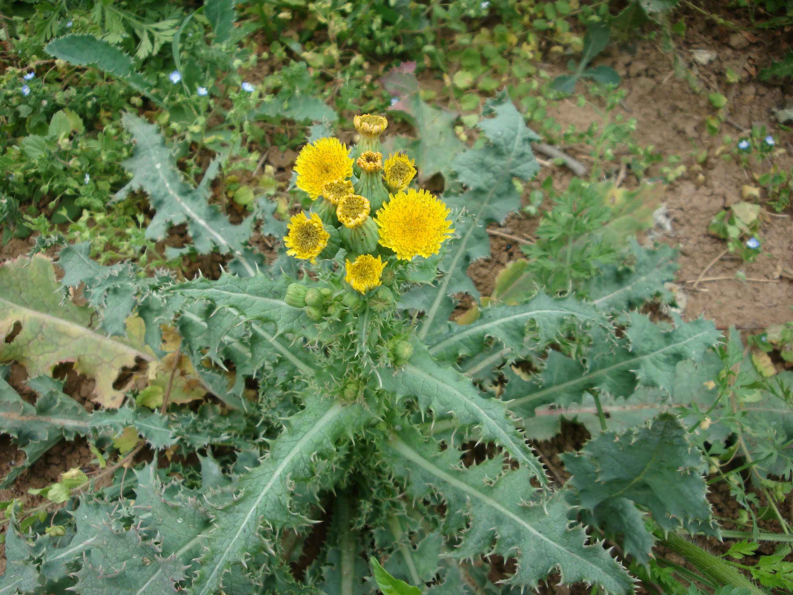

## 苦苣菜

---

**拉丁名:**  _Sonchus oleraceus Linn_

**科 属:** 菊科 帚菊木族 苦苣菜属

**别 名:** 苦菜、尖叶苦菜

**原产地:** 欧洲

**形  态:** 一二年生草本，有纺锤状根。茎中空，直立高50～100厘米，下部无毛，中上部及顶端有稀疏腺毛。叶片柔软无毛，长椭圆状广倒披针形，长15～20厘米，宽3～8厘米，深羽裂或提琴状羽裂，裂片边缘有不整齐的短刺状齿至小尖齿；茎生叶片基部常为尖耳廓状抱茎，基生叶片基部下延成翼柄。头状花序直径约2厘米，花序梗常有腺毛或初期有蛛丝状毛；总苞钟形或圆筒形，长1.2～1.5厘米；舌状花黄色，长约1.3厘米。瘦果倒卵状椭圆形，成熟后红褐色。花果期3～10月。

**西大分布地:** 常见杂草，见于三校区各处。

**备注:** 2009年4月10日摄于西北大学北校区科学楼东侧墙角。　

 

.JPG) 

