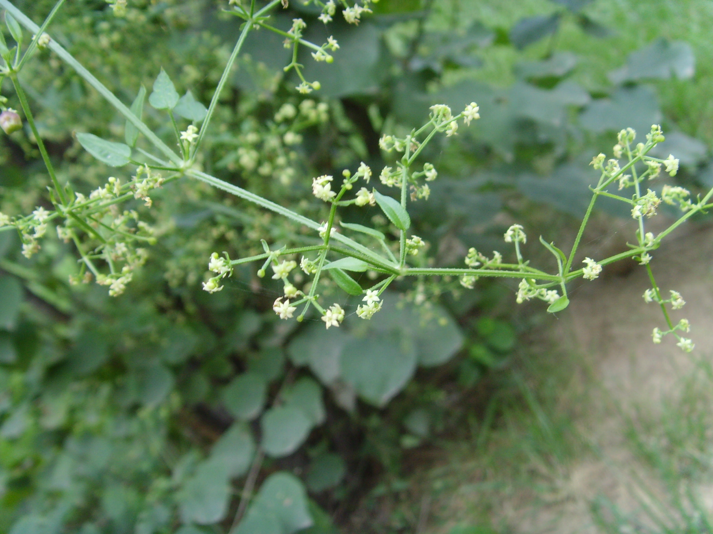
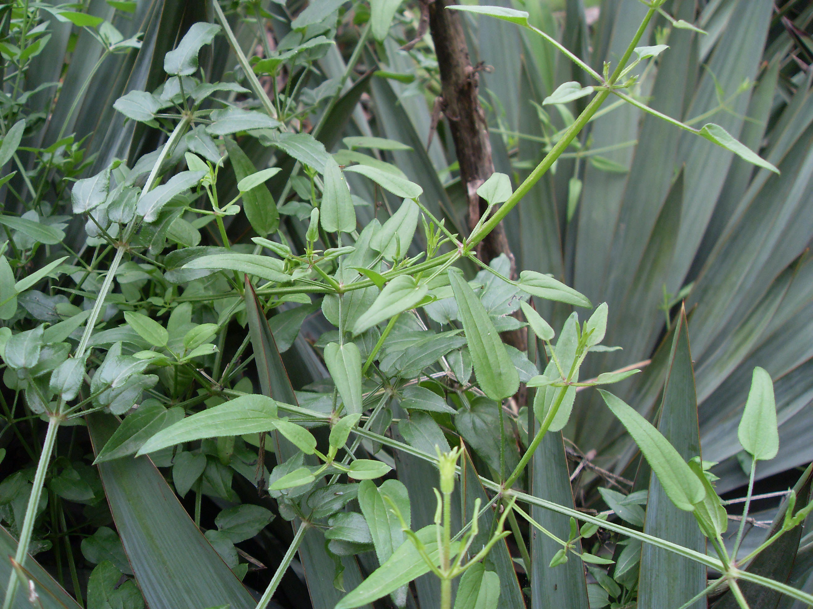
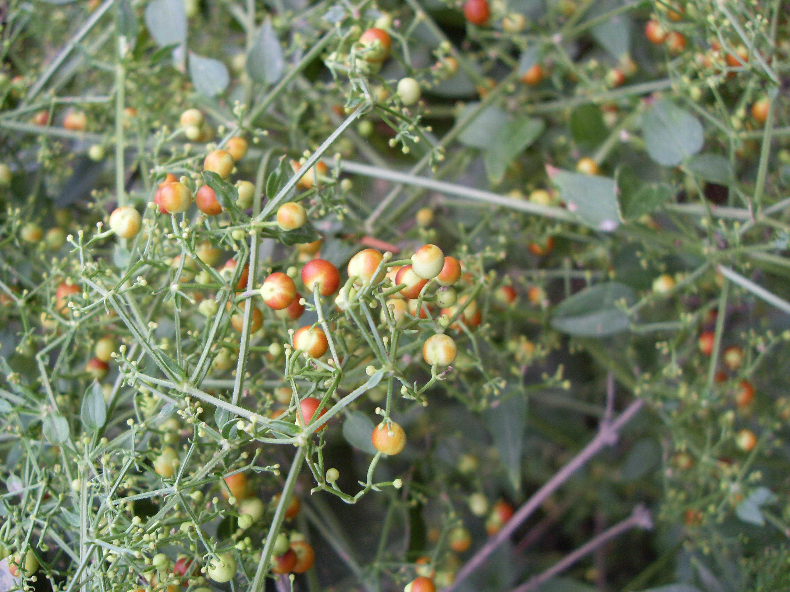

## 茜草

---

**拉丁名:**  _Rubia cordifolia Linn_

**科 属:** 茜草科 茜草属

**别 名:** 红丝线
【形  态】多年生草质攀援藤本。根紫红色或橙红色，小枝有明显
 的四棱角，棱上有倒生小刺。叶常4枚轮生，纸质，卵形或卵状披
 针形，先端渐尖，基部圆形至心表，表面粗糙，背面脉上和叶柄常
 有倒生小刺，基出3～5脉。聚伞花序常排成大而疏松的圆锥花序；
 花小，黄白色。浆果近球形，果实肉质，熟时红色。花期6～8月，
 果期7～9月。
【西大分布地】多见于北校区各草丛及墙角。
　
　
　
                                                                         
                                                                          
   
　
　
　
　
　
　
备注：右上图为茜草株形，2009年5月13日摄于西北大学北校区化工学院周围；
      右下图为茜草果实，2008年10月12日摄于西北大学北校区生科院楼后；
      左图为茜草花枝，2008年9月5日摄于西北大学北校区生科院楼后。
       

**原产地:** 茜 草
详细资料： 首页 下一页 上一页
【拉丁名】Rubia cordifolia Linn.
【科 属】茜草科 茜草属
【别 名】红丝线

**形  态:** 多年生草质攀援藤本。根紫红色或橙红色，小枝有明显的四棱角，棱上有倒生小刺。叶常4枚轮生，纸质，卵形或卵状披针形，先端渐尖，基部圆形至心表，表面粗糙，背面脉上和叶柄常有倒生小刺，基出3～5脉。聚伞花序常排成大而疏松的圆锥花序；花小，黄白色。浆果近球形，果实肉质，熟时红色。花期6～8月，果期7～9月。

**西大分布地:** 多见于北校区各草丛及墙角。　　　 　　　　　　

**备注:** 右上图为茜草株形，2009年5月13日摄于西北大学北校区化工学院周围；右下图为茜草果实，2008年10月12日摄于西北大学北校区生科院楼后；左图为茜草花枝，2008年9月5日摄于西北大学北校区生科院楼后。

 

 

 

