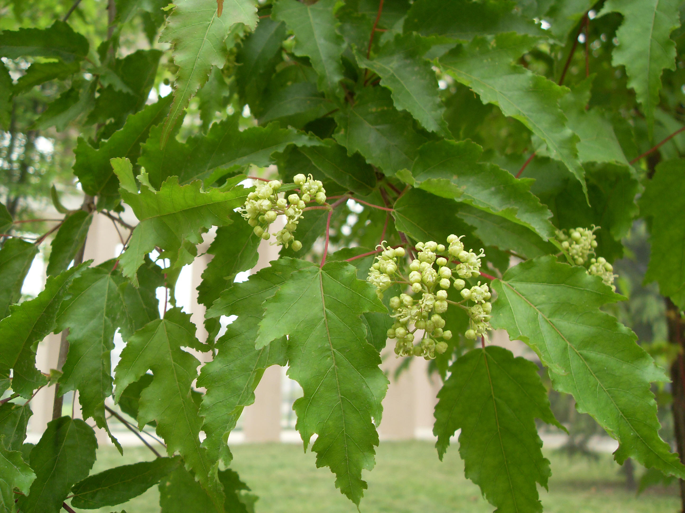

## 茶条槭

---

**拉丁名:**  _Acer ginnala Maxim_

**科 属:** 槭树科 槭属

**别 名:** 华北茶条槭

**原产地:** 中国华北

**形  态:** 落叶灌木或小乔木，高5～6米。树皮灰色，粗糙。单叶，纸质，卵状，常羽状3～5裂，顶端渐尖，基部圆形或近心形，边缘疏具不整齐的重锯齿。伞房花序顶生；花白色，花瓣5.翅果长2.5～3厘米，翅果成锐角开裂。花期4月，果期8月。

**西大分布地:** 仅见于南校区教学六号楼至四号楼之间。

**备注:** 2009年4月10日摄于西北大学南校区教学六号楼至四号楼之间。　

 

