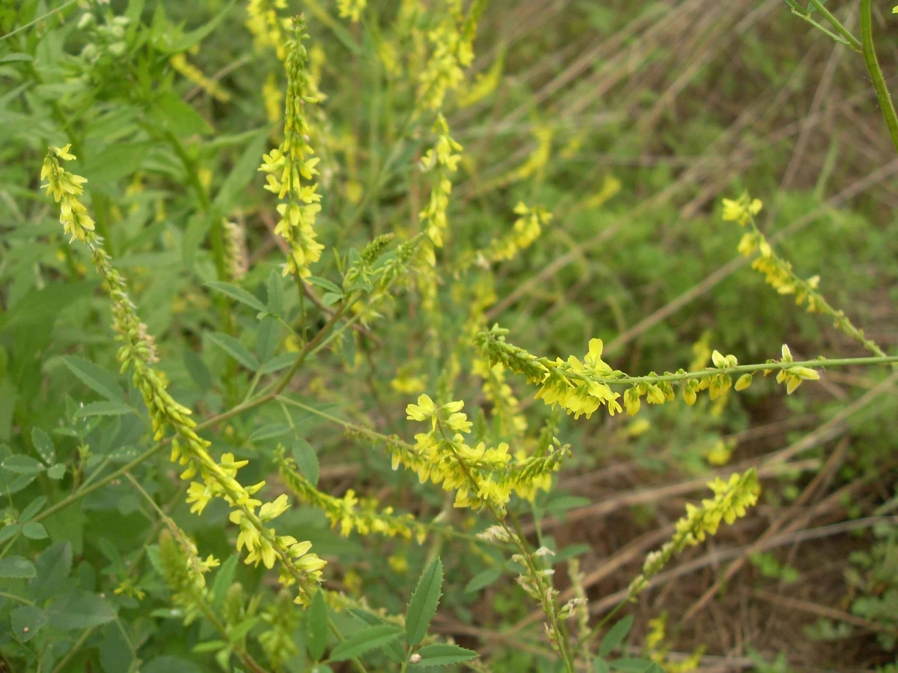

## 草木樨

---

**拉丁名:**  _Melilotus officinalis (Linn.) Pall_

**科 属:** 豆科 草木樨属

**别 名:** 黄花草，黄花草木樨，香马料木樨，野木樨

**原产地:** 不详

**形  态:** 草木樨为二年生或一年生草本。主根深达2米以下。茎直立，多分枝，高50～120厘米，最高可达2米以上；羽状三出复叶，小叶椭圆形或倒披针形，长1～1.5厘米，宽3～6毫米，先端钝，基部楔形，叶缘有疏齿，托叶条形；总状花序腋生或顶生，长而纤细，花小，长3～4毫米，花萼钟状，具5齿，花冠蝶形，黄色，旗瓣长于翼瓣。荚果卵形或近球形，长约3.5毫米，成熟时近黑色，具网纹，含种子1粒。

**西大分布地:** 仅见于南校区待开发区草丛中。

**备注:** 2009年5月17日摄于西北大学南校区待开发区。

.JPG) 

 

