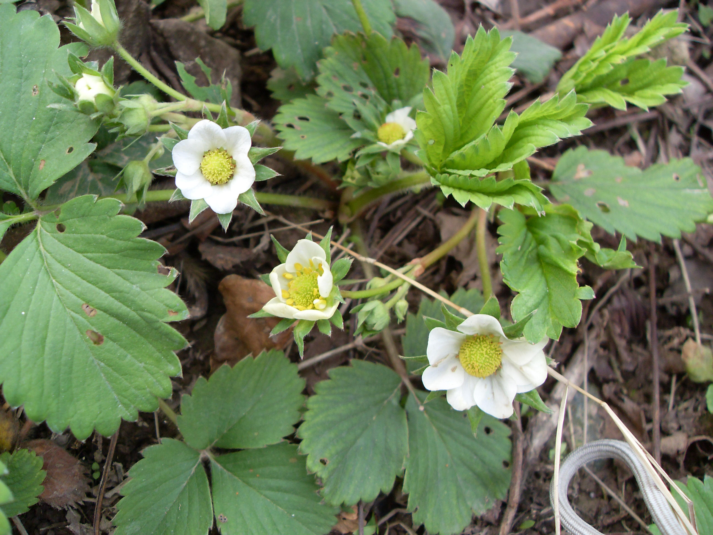
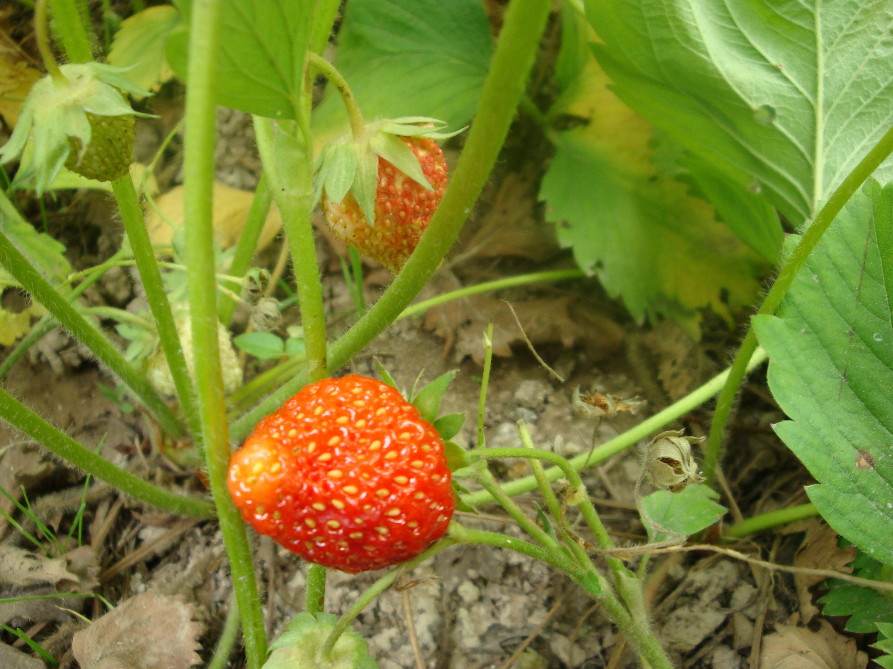

## 草莓

---

**拉丁名:**  _Fragaria ×ananassa Duch_

**科 属:** 蔷薇科 草莓属

**别 名:** 地莓、红莓

**原产地:** 南美洲、欧洲

**形  态:** 多年生草本，高10～40厘米。茎与叶柄被淡黄色柔毛，茎低于叶或近相等，具匍匐枝。三处复叶，小叶菱状卵形，长3～7厘米，宽2～6厘米，先端圆形，基部楔形，边缘具粗锯齿，上面几无毛，背面疏生毛；叶柄长5～10厘米。聚伞花序有花5～15朵，花白色，直径约2厘米，花瓣椭圆形。聚合果肉质膨大，红色，直径1.5～3厘米，萼片宿存，紧贴果实。花期4～5月，果期6～7月。　　　　

**西大分布地:** 仅见于北校区西大花园内。

**备注:** 上图为草莓花枝，2009年3月30日摄于西北大学北校区西大花园内；左图为草莓果枝，2009年5月4日摄于西北大学北校区西大花园内。

 

 

